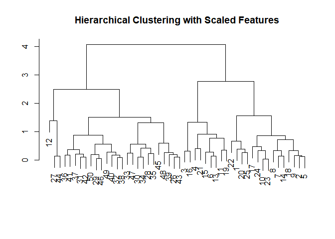

10\. Unsupervised Learning
================

Unsupervised: sample response doesn’t exist, don’t set specific variable
- PCA(unsupervised) vs. PCR(supervised), ofcourse PLS(supervised) - PCA:
loading vector(eigen vector), score vector(scaled with loading vector) -
it MUST DO standardization before PCA. Sum of square of loading vector
is 1, as expression of unit vector - first loading vector a little
related with linear regression(or LDA) - PLA has certain limitation, if
unsupervised

<hr />

  - K-Means Clustering: k is the number of subgroups, minimize
    inner-variance grouping
  - draw randomly, repeat (find centroid(like perfect center), re-draw
    color nearest centroid)
  - Hierarchical Clustering: tree-like visual representation
  - linkage: Complete(maximal), Single(minimal), Average(mean), Centroid
    and so forth
  - Euclidean distance, Correlation-based distance and so on
  - BUT might be unrealistic

### pre-requires

``` r
data(USArrests)
data(NCI60, package = "ISLR")
```

store unique data sets.

``` r
write.csv(NCI60, "NCI60.csv", row.names = T, quote = F)
```

-----

### 1\. PCA (for unsupervised, not PCR)

``` r
states = row.names(USArrests)
names(USArrests)
```

    ## [1] "Murder"   "Assault"  "UrbanPop" "Rape"

##### medium point check & variance check

``` r
apply(USArrests, 2, mean)
```

    ##   Murder  Assault UrbanPop     Rape 
    ##    7.788  170.760   65.540   21.232

``` r
apply(USArrests, 2, var)
```

    ##     Murder    Assault   UrbanPop       Rape 
    ##   18.97047 6945.16571  209.51878   87.72916

``` r
pr.out = prcomp(USArrests, scale = T)
```

> default: scaled to mean zero

##### detail check

``` r
names(pr.out)
```

    ## [1] "sdev"     "rotation" "center"   "scale"    "x"

``` r
pr.out$center
```

    ##   Murder  Assault UrbanPop     Rape 
    ##    7.788  170.760   65.540   21.232

``` r
pr.out$scale
```

    ##    Murder   Assault  UrbanPop      Rape 
    ##  4.355510 83.337661 14.474763  9.366385

``` r
pr.out$rotation
```

    ##                 PC1        PC2        PC3         PC4
    ## Murder   -0.5358995  0.4181809 -0.3412327  0.64922780
    ## Assault  -0.5831836  0.1879856 -0.2681484 -0.74340748
    ## UrbanPop -0.2781909 -0.8728062 -0.3780158  0.13387773
    ## Rape     -0.5434321 -0.1673186  0.8177779  0.08902432

> rotation: loading vector

``` r
dim(pr.out$x)
```

    ## [1] 50  4

``` r
biplot(pr.out, scale = 0)
```


  - overall sign change is possible

<!-- end list -->

``` r
pr.out$rotation = -pr.out$rotation
pr.out$x = -pr.out$x
```

``` r
biplot(pr.out, scale = 0)
```


``` r
pr.var = pr.out$sdev^2
pve = pr.var/sum(pr.var); rm(pr.var)
pve
```

    ## [1] 0.62006039 0.24744129 0.08914080 0.04335752

``` r
par(mfrow = c(1,2))
plot(pve, xlab = "Principal Component", ylab = "Proportion of Variance Explained", ylim = c(0,1), type = 'b')
plot(cumsum(pve), xlab = "Principal Component", ylab = "Cumulative Proportion of Variance Explained", ylim = c(0,1), type = 'b')
```


##### addition, cumsum function check

``` r
cumsum() check
a = c(1, 2, 8, -3)
cumsum(a)
```

-----

### 2\. Clustering

#### K-Means Clustering

``` r
## set.seed(2)
X = matrix(rnorm(50*2), ncol = 2)
X[1:25, 1] = X[1:25, 1] + 3
X[1:25, 2] = X[1:25, 2] - 4
```

``` r
km.out = kmeans(X, 2, nstart = 20)
km.out$cluster
```

    ##  [1] 1 1 1 1 1 1 1 1 1 1 1 1 1 1 1 1 1 1 1 1 1 1 1 1 1 2 2 2 2 2 2 2 2 2 2 2 2 2
    ## [39] 2 2 2 2 2 2 2 2 2 2 2 2

  - perfectly separate

<!-- end list -->

``` r
plot(X, col = (km.out$cluster + 1), main = "K-Means Clustering Results with K = 2", xlab = "", ylab = "", pch = 20, cex = 2)
```


``` r
## set.seed(4)
km.out = kmeans(X, 3, nstart = 20)
km.out
```

    ## K-means clustering with 3 clusters of sizes 10, 25, 15
    ## 
    ## Cluster means:
    ##        [,1]         [,2]
    ## 1  3.911028 -3.390179953
    ## 2 -0.348671  0.003522189
    ## 3  2.030460 -4.533620585
    ## 
    ## Clustering vector:
    ##  [1] 1 3 3 3 1 3 3 1 1 3 1 3 1 3 3 3 3 3 1 1 1 3 3 1 3 2 2 2 2 2 2 2 2 2 2 2 2 2
    ## [39] 2 2 2 2 2 2 2 2 2 2 2 2
    ## 
    ## Within cluster sum of squares by cluster:
    ## [1] 11.93277 44.25812 14.31212
    ##  (between_SS / total_SS =  83.6 %)
    ## 
    ## Available components:
    ## 
    ## [1] "cluster"      "centers"      "totss"        "withinss"     "tot.withinss"
    ## [6] "betweenss"    "size"         "iter"         "ifault"

``` r
plot(X, col = c(km.out$cluster + 1), main = "K-Means Clustering Results with K = 3", xlab = "", ylab = "", pch = 20, cex = 2)
```


  - separate left top, little right middle, right bottom

<!-- end list -->

``` r
## set.seed(3)
km.out = kmeans(X, 3, nstart = 1)
km.out$tot.withinss
```

    ## [1] 70.50301

> nstart: the number of repeat

``` r
km.out = kmeans(X, 3, nstart = 20)
km.out$tot.withinss
```

    ## [1] 70.50301

> tot.withinss: total inner-variance

#### Hierarchical Clustering

``` r
hc.complete = hclust(dist(X), "complete")
hc.average = hclust(dist(X), "average")
hc.single = hclust(dist(X), "single")
```

``` r
par(mfrow = c(1,3))
plot(hc.complete, main = "Complete Linkage", xlab = "", ylab = "", sub = "", cex = .9)
plot(hc.average, main = "Average Linkage", xlab = "", ylab = "", sub = "", cex = .9)
plot(hc.single, main = "Single Linkage", xlab = "", ylab = "", sub = "", cex = .9)
```


``` r
cutree(hc.complete, 2)
```

    ##  [1] 1 1 1 1 1 1 1 1 1 1 1 1 1 1 1 1 1 1 1 1 1 1 1 1 1 2 2 2 2 2 2 2 2 2 2 2 2 2
    ## [39] 2 2 2 2 2 2 2 2 2 2 2 2

``` r
cutree(hc.average, 2)
```

    ##  [1] 1 1 1 1 1 1 1 1 1 1 1 1 1 1 1 1 1 1 1 1 1 1 1 1 1 2 2 2 2 2 2 2 2 2 2 2 2 2
    ## [39] 2 2 2 2 2 2 2 2 2 2 2 2

``` r
cutree(hc.single, 2)
```

    ##  [1] 1 1 1 1 1 1 1 1 1 1 1 1 1 1 1 1 1 1 1 1 1 1 1 1 1 2 2 2 2 2 2 2 2 2 2 2 2 2
    ## [39] 2 2 2 2 2 2 2 2 2 2 2 2

alike and differ

``` r
xsc = scale(X)
plot(hclust(dist(xsc), "complete"), main = "Hierarchical Clustering with Scaled Features", xlab = "", ylab = "", sub = "")
```


아, 나 저 글씨 뒤집는 거 배웠는데 기억이 안 난다.

##### Correlation-based distance

``` r
X = matrix(rnorm(30*3), ncol = 3)
plot(hclust(as.dist(1 - cor(t(X))), "complete"), main = "Complete Linkage with Correlation-Based Distance", xlab = "", ylab = "", sub = "")
```



-----

### NCI60 Data

``` r
nci.labs = NCI60$labs
nci.data = NCI60$data
```

``` r
dim(nci.data)
```

    ## [1]   64 6830

``` r
nci.labs[1:4]
```

    ## [1] "CNS"   "CNS"   "CNS"   "RENAL"

``` r
table(nci.labs)
```

    ## nci.labs
    ##      BREAST         CNS       COLON K562A-repro K562B-repro    LEUKEMIA 
    ##           7           5           7           1           1           6 
    ## MCF7A-repro MCF7D-repro    MELANOMA       NSCLC     OVARIAN    PROSTATE 
    ##           1           1           8           9           6           2 
    ##       RENAL     UNKNOWN 
    ##           9           1

#### PCA on the data

``` r
pr.out = prcomp(nci.data, scale = T)
```

``` r
Cols = function(vec) {
        cols = rainbow(length(unique(vec)))
        return(cols[as.numeric(as.factor(vec))])
}
```

``` r
par(mfrow = c(1,2))
plot(pr.out$x[, 1:2], col = Cols(nci.labs), pch = 19, xlab = "Z1", ylab = "Z2")
plot(pr.out$x[, c(1,3)], col = Cols(nci.labs), pch = 19, xlab = "Z1", ylab = "Z3")
```


  - didn’t see as similar gene, very messy colorful?

<!-- end list -->

``` r
summary(pr.out)
```

    ## Importance of components:
    ##                            PC1      PC2      PC3      PC4      PC5      PC6
    ## Standard deviation     27.8535 21.48136 19.82046 17.03256 15.97181 15.72108
    ## Proportion of Variance  0.1136  0.06756  0.05752  0.04248  0.03735  0.03619
    ## Cumulative Proportion   0.1136  0.18115  0.23867  0.28115  0.31850  0.35468
    ##                             PC7      PC8      PC9     PC10     PC11     PC12
    ## Standard deviation     14.47145 13.54427 13.14400 12.73860 12.68672 12.15769
    ## Proportion of Variance  0.03066  0.02686  0.02529  0.02376  0.02357  0.02164
    ## Cumulative Proportion   0.38534  0.41220  0.43750  0.46126  0.48482  0.50646
    ##                            PC13     PC14     PC15     PC16     PC17     PC18
    ## Standard deviation     11.83019 11.62554 11.43779 11.00051 10.65666 10.48880
    ## Proportion of Variance  0.02049  0.01979  0.01915  0.01772  0.01663  0.01611
    ## Cumulative Proportion   0.52695  0.54674  0.56590  0.58361  0.60024  0.61635
    ##                            PC19    PC20     PC21    PC22    PC23    PC24
    ## Standard deviation     10.43518 10.3219 10.14608 10.0544 9.90265 9.64766
    ## Proportion of Variance  0.01594  0.0156  0.01507  0.0148 0.01436 0.01363
    ## Cumulative Proportion   0.63229  0.6479  0.66296  0.6778 0.69212 0.70575
    ##                           PC25    PC26    PC27   PC28    PC29    PC30    PC31
    ## Standard deviation     9.50764 9.33253 9.27320 9.0900 8.98117 8.75003 8.59962
    ## Proportion of Variance 0.01324 0.01275 0.01259 0.0121 0.01181 0.01121 0.01083
    ## Cumulative Proportion  0.71899 0.73174 0.74433 0.7564 0.76824 0.77945 0.79027
    ##                           PC32    PC33    PC34    PC35    PC36    PC37    PC38
    ## Standard deviation     8.44738 8.37305 8.21579 8.15731 7.97465 7.90446 7.82127
    ## Proportion of Variance 0.01045 0.01026 0.00988 0.00974 0.00931 0.00915 0.00896
    ## Cumulative Proportion  0.80072 0.81099 0.82087 0.83061 0.83992 0.84907 0.85803
    ##                           PC39    PC40    PC41   PC42    PC43   PC44    PC45
    ## Standard deviation     7.72156 7.58603 7.45619 7.3444 7.10449 7.0131 6.95839
    ## Proportion of Variance 0.00873 0.00843 0.00814 0.0079 0.00739 0.0072 0.00709
    ## Cumulative Proportion  0.86676 0.87518 0.88332 0.8912 0.89861 0.9058 0.91290
    ##                          PC46    PC47    PC48    PC49    PC50    PC51    PC52
    ## Standard deviation     6.8663 6.80744 6.64763 6.61607 6.40793 6.21984 6.20326
    ## Proportion of Variance 0.0069 0.00678 0.00647 0.00641 0.00601 0.00566 0.00563
    ## Cumulative Proportion  0.9198 0.92659 0.93306 0.93947 0.94548 0.95114 0.95678
    ##                           PC53    PC54    PC55    PC56    PC57   PC58    PC59
    ## Standard deviation     6.06706 5.91805 5.91233 5.73539 5.47261 5.2921 5.02117
    ## Proportion of Variance 0.00539 0.00513 0.00512 0.00482 0.00438 0.0041 0.00369
    ## Cumulative Proportion  0.96216 0.96729 0.97241 0.97723 0.98161 0.9857 0.98940
    ##                           PC60    PC61    PC62    PC63      PC64
    ## Standard deviation     4.68398 4.17567 4.08212 4.04124 2.148e-14
    ## Proportion of Variance 0.00321 0.00255 0.00244 0.00239 0.000e+00
    ## Cumulative Proportion  0.99262 0.99517 0.99761 1.00000 1.000e+00

``` r
## summary(pr.out)$importance
```

``` r
plot(pr.out)
```


  - square of sdev

<!-- end list -->

``` r
pve = 100 * pr.out$sdev^2/sum(pr.out$sdev^2)
```

``` r
par(mfrow = c(1,2))
plot(pve, type = 'o', xlab = "Principal Component", ylab = "PVE", col = "lightblue")
plot(cumsum(pve), type = 'o', xlab = "Principal Component", ylab = "Cumulative PVE", col = "lightseagreen")
```


  - brown3

elbow point is 7

#### Clustering on the data

``` r
sd.data = scale(nci.data)
```

``` r
data.dist = dist(sd.data)
plot(hclust(data.dist), labels = nci.labs, main = "Complete Linkage", xlab = "", ylab = "", sub = "")
```


``` r
plot(hclust(data.dist, "average"), labels = nci.labs, main = "Average Linkage", xlab = "", ylab = "", sub = "")
```


``` r
plot(hclust(data.dist, "single"), labels = nci.labs, main = "Single Linkage", xlab = "", ylab = "", sub = "")
```


``` r
hc.out = hclust(dist(sd.data))
hc.clusters = cutree(hc.out, 4)
```

> cutree( ) doesn’t say cut point?

``` r
table(hc.clusters, nci.labs)
```

    ##            nci.labs
    ## hc.clusters BREAST CNS COLON K562A-repro K562B-repro LEUKEMIA MCF7A-repro
    ##           1      2   3     2           0           0        0           0
    ##           2      3   2     0           0           0        0           0
    ##           3      0   0     0           1           1        6           0
    ##           4      2   0     5           0           0        0           1
    ##            nci.labs
    ## hc.clusters MCF7D-repro MELANOMA NSCLC OVARIAN PROSTATE RENAL UNKNOWN
    ##           1           0        8     8       6        2     8       1
    ##           2           0        0     1       0        0     1       0
    ##           3           0        0     0       0        0     0       0
    ##           4           1        0     0       0        0     0       0

``` r
plot(hc.out, labels = nci.labs, sub = "", xlab = "")
abline(h = 139, col = "red")
```


``` r
hc.out
```

    ## 
    ## Call:
    ## hclust(d = dist(sd.data))
    ## 
    ## Cluster method   : complete 
    ## Distance         : euclidean 
    ## Number of objects: 64

``` r
## set.seed(2)
km.out = kmeans(sd.data, 4, nstart = 20)
km.clusters = km.out$cluster
table(km.clusters, hc.clusters)
```

    ##            hc.clusters
    ## km.clusters  1  2  3  4
    ##           1 20  7  0  0
    ##           2 11  0  0  9
    ##           3  9  0  0  0
    ##           4  0  0  8  0

  - hierarchical is un-realistic

<!-- end list -->

``` r
hc.out = hclust(dist(pr.out$x[, 1:5]))
```

``` r
plot(hc.out, labels = nci.labs, main = "Hier. Clust. on First Five Score Vectors", sub = "", xlab = "")
```


``` r
## abline(h = 100, col = "red")
```

``` r
table(cutree(hc.out, 4), nci.labs)
```

    ##    nci.labs
    ##     BREAST CNS COLON K562A-repro K562B-repro LEUKEMIA MCF7A-repro MCF7D-repro
    ##   1      0   2     7           0           0        2           0           0
    ##   2      5   3     0           0           0        0           0           0
    ##   3      0   0     0           1           1        4           0           0
    ##   4      2   0     0           0           0        0           1           1
    ##    nci.labs
    ##     MELANOMA NSCLC OVARIAN PROSTATE RENAL UNKNOWN
    ##   1        1     8       5        2     7       0
    ##   2        7     1       1        0     2       1
    ##   3        0     0       0        0     0       0
    ##   4        0     0       0        0     0       0

  - changed lots of things
