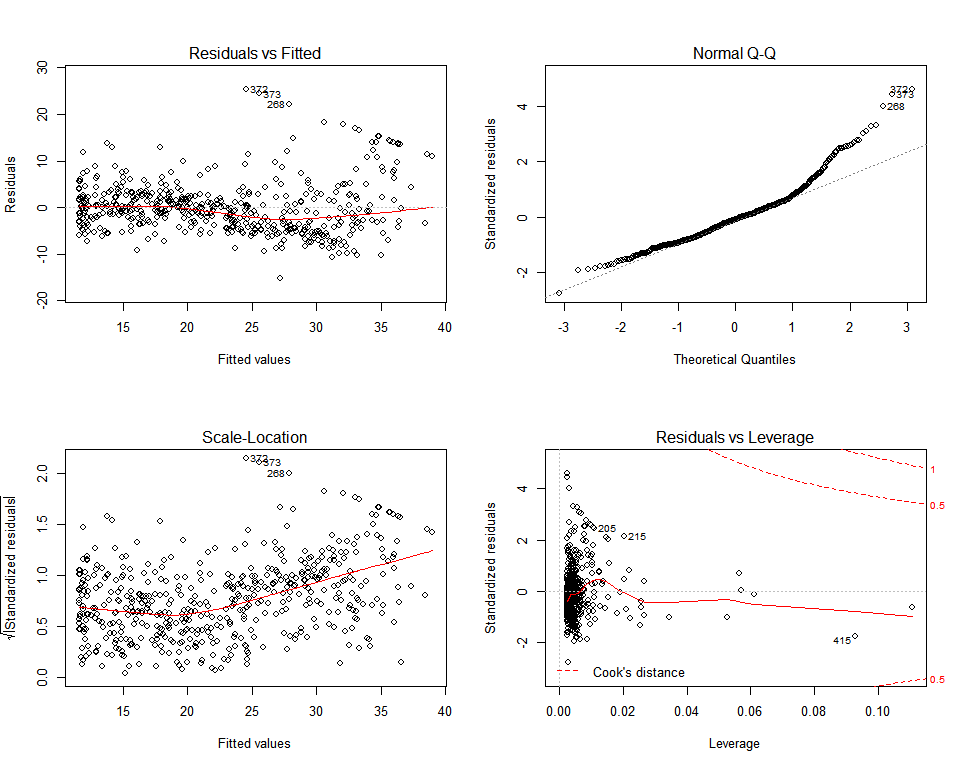

3\. Linear Regression
================

### pre-requires

store unique data sets.

``` r
write.csv(Boston, "Boston.csv", row.names = F, quote = F)
write.csv(Carseats, "Carseats.csv", row.names = T, quote = F)
```

### 2\. Multiple Linear Regression

``` r
lm.fit = lm(medv ~ lstat + age, data = Boston)
summary(lm.fit)
```

    ## 
    ## Call:
    ## lm(formula = medv ~ lstat + age, data = Boston)
    ## 
    ## Residuals:
    ##     Min      1Q  Median      3Q     Max 
    ## -15.981  -3.978  -1.283   1.968  23.158 
    ## 
    ## Coefficients:
    ##             Estimate Std. Error t value Pr(>|t|)    
    ## (Intercept) 33.22276    0.73085  45.458  < 2e-16 ***
    ## lstat       -1.03207    0.04819 -21.416  < 2e-16 ***
    ## age          0.03454    0.01223   2.826  0.00491 ** 
    ## ---
    ## Signif. codes:  0 '***' 0.001 '**' 0.01 '*' 0.05 '.' 0.1 ' ' 1
    ## 
    ## Residual standard error: 6.173 on 503 degrees of freedom
    ## Multiple R-squared:  0.5513, Adjusted R-squared:  0.5495 
    ## F-statistic:   309 on 2 and 503 DF,  p-value: < 2.2e-16

``` r
## lm.fit = lm(medv ~, data = Boston)
## summary(lm.fit)
```

``` r
vif(lm.fit)
```

    ##    lstat      age 
    ## 1.569395 1.569395

``` r
lm.fit1 = lm(medv ~. - age, data = Boston)
## lm.fit1 = update(lm.fit, ~.-age)
summary(lm.fit1)
```

    ## 
    ## Call:
    ## lm(formula = medv ~ . - age, data = Boston)
    ## 
    ## Residuals:
    ##      Min       1Q   Median       3Q      Max 
    ## -15.6054  -2.7313  -0.5188   1.7601  26.2243 
    ## 
    ## Coefficients:
    ##               Estimate Std. Error t value Pr(>|t|)    
    ## (Intercept)  36.436927   5.080119   7.172 2.72e-12 ***
    ## crim         -0.108006   0.032832  -3.290 0.001075 ** 
    ## zn            0.046334   0.013613   3.404 0.000719 ***
    ## indus         0.020562   0.061433   0.335 0.737989    
    ## chas          2.689026   0.859598   3.128 0.001863 ** 
    ## nox         -17.713540   3.679308  -4.814 1.97e-06 ***
    ## rm            3.814394   0.408480   9.338  < 2e-16 ***
    ## dis          -1.478612   0.190611  -7.757 5.03e-14 ***
    ## rad           0.305786   0.066089   4.627 4.75e-06 ***
    ## tax          -0.012329   0.003755  -3.283 0.001099 ** 
    ## ptratio      -0.952211   0.130294  -7.308 1.10e-12 ***
    ## black         0.009321   0.002678   3.481 0.000544 ***
    ## lstat        -0.523852   0.047625 -10.999  < 2e-16 ***
    ## ---
    ## Signif. codes:  0 '***' 0.001 '**' 0.01 '*' 0.05 '.' 0.1 ' ' 1
    ## 
    ## Residual standard error: 4.74 on 493 degrees of freedom
    ## Multiple R-squared:  0.7406, Adjusted R-squared:  0.7343 
    ## F-statistic: 117.3 on 12 and 493 DF,  p-value: < 2.2e-16

> update( ): literally update (fit) function

### 4\. Non-linear Transormations of the Predictors

``` r
lm.fit2 = lm(medv ~ lstat + I(lstat^2), data = Boston)
summary(lm.fit2)
```

    ## 
    ## Call:
    ## lm(formula = medv ~ lstat + I(lstat^2), data = Boston)
    ## 
    ## Residuals:
    ##      Min       1Q   Median       3Q      Max 
    ## -15.2834  -3.8313  -0.5295   2.3095  25.4148 
    ## 
    ## Coefficients:
    ##              Estimate Std. Error t value Pr(>|t|)    
    ## (Intercept) 42.862007   0.872084   49.15   <2e-16 ***
    ## lstat       -2.332821   0.123803  -18.84   <2e-16 ***
    ## I(lstat^2)   0.043547   0.003745   11.63   <2e-16 ***
    ## ---
    ## Signif. codes:  0 '***' 0.001 '**' 0.01 '*' 0.05 '.' 0.1 ' ' 1
    ## 
    ## Residual standard error: 5.524 on 503 degrees of freedom
    ## Multiple R-squared:  0.6407, Adjusted R-squared:  0.6393 
    ## F-statistic: 448.5 on 2 and 503 DF,  p-value: < 2.2e-16

represent two-square term through ‘^’, ‘I( )’

``` r
par(mfrow = c(2,2))
plot(lm.fit2)
```

<!-- -->

##### compare with normal and quadratic

``` r
lm.fit = lm(medv ~ lstat, data = Boston)
anova(lm.fit, lm.fit2)
```

    ## Analysis of Variance Table
    ## 
    ## Model 1: medv ~ lstat
    ## Model 2: medv ~ lstat + I(lstat^2)
    ##   Res.Df   RSS Df Sum of Sq     F    Pr(>F)    
    ## 1    504 19472                                 
    ## 2    503 15347  1    4125.1 135.2 < 2.2e-16 ***
    ## ---
    ## Signif. codes:  0 '***' 0.001 '**' 0.01 '*' 0.05 '.' 0.1 ' ' 1

##### 5-degree poly

``` r
lm.fit5 = lm(medv ~ poly(lstat, 5), data = Boston)
summary(lm.fit5)
```

    ## 
    ## Call:
    ## lm(formula = medv ~ poly(lstat, 5), data = Boston)
    ## 
    ## Residuals:
    ##      Min       1Q   Median       3Q      Max 
    ## -13.5433  -3.1039  -0.7052   2.0844  27.1153 
    ## 
    ## Coefficients:
    ##                  Estimate Std. Error t value Pr(>|t|)    
    ## (Intercept)       22.5328     0.2318  97.197  < 2e-16 ***
    ## poly(lstat, 5)1 -152.4595     5.2148 -29.236  < 2e-16 ***
    ## poly(lstat, 5)2   64.2272     5.2148  12.316  < 2e-16 ***
    ## poly(lstat, 5)3  -27.0511     5.2148  -5.187 3.10e-07 ***
    ## poly(lstat, 5)4   25.4517     5.2148   4.881 1.42e-06 ***
    ## poly(lstat, 5)5  -19.2524     5.2148  -3.692 0.000247 ***
    ## ---
    ## Signif. codes:  0 '***' 0.001 '**' 0.01 '*' 0.05 '.' 0.1 ' ' 1
    ## 
    ## Residual standard error: 5.215 on 500 degrees of freedom
    ## Multiple R-squared:  0.6817, Adjusted R-squared:  0.6785 
    ## F-statistic: 214.2 on 5 and 500 DF,  p-value: < 2.2e-16

##### log

``` r
summary(lm(medv ~ log(rm), data = Boston))
```

    ## 
    ## Call:
    ## lm(formula = medv ~ log(rm), data = Boston)
    ## 
    ## Residuals:
    ##     Min      1Q  Median      3Q     Max 
    ## -19.487  -2.875  -0.104   2.837  39.816 
    ## 
    ## Coefficients:
    ##             Estimate Std. Error t value Pr(>|t|)    
    ## (Intercept)  -76.488      5.028  -15.21   <2e-16 ***
    ## log(rm)       54.055      2.739   19.73   <2e-16 ***
    ## ---
    ## Signif. codes:  0 '***' 0.001 '**' 0.01 '*' 0.05 '.' 0.1 ' ' 1
    ## 
    ## Residual standard error: 6.915 on 504 degrees of freedom
    ## Multiple R-squared:  0.4358, Adjusted R-squared:  0.4347 
    ## F-statistic: 389.3 on 1 and 504 DF,  p-value: < 2.2e-16

boldly skip for custom (combine) function
