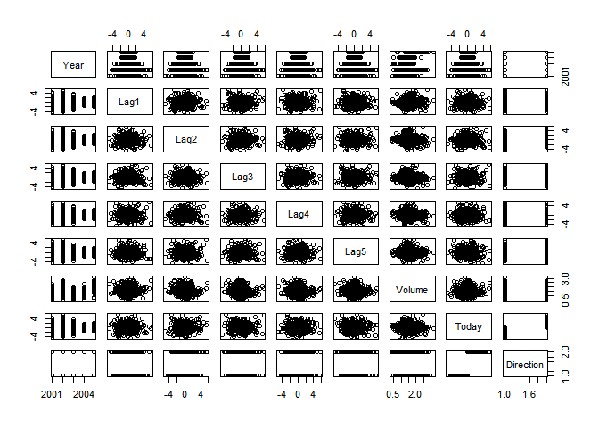
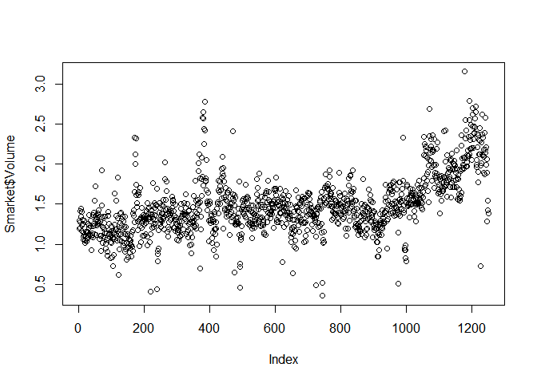

4\. Classification
================

classify를 위해서 Bayes’ Theoream을 이용, Bayes’ Classifier를 구해야 함.<br /> 이 때문에
LR, LDA, QDA, KNN 방법을 비교

  - LR: 회귀 기본 가정, logit을 통해 response을 \[0,1\]로 제한하는 방법
  - LDA: Gaussian(Multiple Normal), response를 선형 분리, 파이 값 정해야 함.(p = 1,
    등분산 -\> LR과 같음)
  - QDA: Normal, no Linear, respnse를 곡선으로 분리
  - KNN: 1이거나 class level을 정해야 함, 선형일 때를 제외하고는 수준을 정했을 때가 이상적인 방법이긴 한데,
    다른 방법론에 비해 악, 최악이 걸릴 수준이 가능성이 높음.

### pre-requires

Smarket: Stock Market Data

``` r
cor(Smarket[,-9])
```

    ##              Year         Lag1         Lag2         Lag3         Lag4
    ## Year   1.00000000  0.029699649  0.030596422  0.033194581  0.035688718
    ## Lag1   0.02969965  1.000000000 -0.026294328 -0.010803402 -0.002985911
    ## Lag2   0.03059642 -0.026294328  1.000000000 -0.025896670 -0.010853533
    ## Lag3   0.03319458 -0.010803402 -0.025896670  1.000000000 -0.024051036
    ## Lag4   0.03568872 -0.002985911 -0.010853533 -0.024051036  1.000000000
    ## Lag5   0.02978799 -0.005674606 -0.003557949 -0.018808338 -0.027083641
    ## Volume 0.53900647  0.040909908 -0.043383215 -0.041823686 -0.048414246
    ## Today  0.03009523 -0.026155045 -0.010250033 -0.002447647 -0.006899527
    ##                Lag5      Volume        Today
    ## Year    0.029787995  0.53900647  0.030095229
    ## Lag1   -0.005674606  0.04090991 -0.026155045
    ## Lag2   -0.003557949 -0.04338321 -0.010250033
    ## Lag3   -0.018808338 -0.04182369 -0.002447647
    ## Lag4   -0.027083641 -0.04841425 -0.006899527
    ## Lag5    1.000000000 -0.02200231 -0.034860083
    ## Volume -0.022002315  1.00000000  0.014591823
    ## Today  -0.034860083  0.01459182  1.000000000

``` r
pairs(Smarket)
```



``` r
plot(Smarket$Volume)
```



store unique data sets.

``` r
write.csv(Smarket, "Smarket.csv", row.names = F, quote = F)
```

-----

### 1\. Logistic Regression

``` r
glm.fits = glm(Direction ~ Lag1 + Lag2 + Lag3 + Lag4 + Lag5 + Volume, family = binomial)
summary(glm.fits)
```

    ## 
    ## Call:
    ## glm(formula = Direction ~ Lag1 + Lag2 + Lag3 + Lag4 + Lag5 + 
    ##     Volume, family = binomial)
    ## 
    ## Deviance Residuals: 
    ##    Min      1Q  Median      3Q     Max  
    ## -1.446  -1.203   1.065   1.145   1.326  
    ## 
    ## Coefficients:
    ##              Estimate Std. Error z value Pr(>|z|)
    ## (Intercept) -0.126000   0.240736  -0.523    0.601
    ## Lag1        -0.073074   0.050167  -1.457    0.145
    ## Lag2        -0.042301   0.050086  -0.845    0.398
    ## Lag3         0.011085   0.049939   0.222    0.824
    ## Lag4         0.009359   0.049974   0.187    0.851
    ## Lag5         0.010313   0.049511   0.208    0.835
    ## Volume       0.135441   0.158360   0.855    0.392
    ## 
    ## (Dispersion parameter for binomial family taken to be 1)
    ## 
    ##     Null deviance: 1731.2  on 1249  degrees of freedom
    ## Residual deviance: 1727.6  on 1243  degrees of freedom
    ## AIC: 1741.6
    ## 
    ## Number of Fisher Scoring iterations: 3

``` r
## coef(glm.fits;  summary(glm.fits)$coef; summary(glm.gits)$coef[,4]
```

``` r
glm.probs = predict(glm.fits, type = "response")
## glm.probs[1:10]
contrasts(Direction)
```

    ##      Up
    ## Down  0
    ## Up    1

comprehensive(overall) evaluation for direction, qualitative response
variable

``` r
table(glm.pred, Direction)
```

    ##         Direction
    ## glm.pred Down  Up
    ##     Down  145 141
    ##     Up    457 507

``` r
mean(glm.pred == Direction)
```

    ## [1] 0.5216

on first test, it observed 52.2%

#### on train data

##### train data on all variables

``` r
table(glm.pred, Direction.2005)
```

    ##         Direction.2005
    ## glm.pred Down Up
    ##     Down   77 97
    ##     Up     34 44

``` r
mean(glm.pred == Direction.2005)
```

    ## [1] 0.4801587

on first test, it observed 48%

##### train data on 2 variables

``` r
table(glm.pred, Direction.2005)
```

    ##         Direction.2005
    ## glm.pred Down  Up
    ##     Down   35  35
    ##     Up     76 106

``` r
mean(glm.pred == Direction.2005)
```

    ## [1] 0.5595238

on first test, it observed 56%

also, choose second model using two variables

``` r
predict(glm.fits, newdata = data.frame(Lag1 = c(1.2, 1.5), Lag2 = c(1.1, -0.8)), type = "response")
```

    ##         1         2 
    ## 0.4791462 0.4960939

-----

### 2\. LDA: Linear Discriminant Analysis

``` r
lda.fit = lda(Direction ~ Lag1 + Lag2, subset = train)
lda.fit
```

    ## Call:
    ## lda(Direction ~ Lag1 + Lag2, subset = train)
    ## 
    ## Prior probabilities of groups:
    ##     Down       Up 
    ## 0.491984 0.508016 
    ## 
    ## Group means:
    ##             Lag1        Lag2
    ## Down  0.04279022  0.03389409
    ## Up   -0.03954635 -0.03132544
    ## 
    ## Coefficients of linear discriminants:
    ##             LD1
    ## Lag1 -0.6420190
    ## Lag2 -0.5135293

on first test, \(\phi_1\) = 0.492, \(\phi_2\) = 0.508

``` r
lda.class = lda.pred$class
table(lda.class, Direction.2005)
```

    ##          Direction.2005
    ## lda.class Down  Up
    ##      Down   35  35
    ##      Up     76 106

``` r
mean(lda.class == Direction.2005)
```

    ## [1] 0.5595238

on first test, it observed 56%

``` r
sum(lda.pred$posterior[,1] >= .5)
```

    ## [1] 70

``` r
sum(lda.pred$posterior[,1] < 0.5)
```

    ## [1] 182

relate with market growth decrease and post-prob on model

``` r
## lda.pred$posterior[1:20,1]
## lda.class[1:20]
sum(lda.pred$posterior[,1] > 0.9)
```

    ## [1] 0

-----

### 3\. QDA: Quadratic Discriminant Analysis

``` r
qda.fit = qda(Direction ~ Lag1 + Lag2, subset = train)
qda.fit
```

    ## Call:
    ## qda(Direction ~ Lag1 + Lag2, subset = train)
    ## 
    ## Prior probabilities of groups:
    ##     Down       Up 
    ## 0.491984 0.508016 
    ## 
    ## Group means:
    ##             Lag1        Lag2
    ## Down  0.04279022  0.03389409
    ## Up   -0.03954635 -0.03132544

``` r
qda.class = predict(qda.fit, Smarket.2005)$class
table(qda.class, Direction.2005)
```

    ##          Direction.2005
    ## qda.class Down  Up
    ##      Down   30  20
    ##      Up     81 121

``` r
mean(qda.class == Direction.2005)
```

    ## [1] 0.5992063

on first test, it observed 59.9%

-----

### 4\. KNN: K-Nearest Neightbors

train data

``` r
## set.seed(1)
knn.pred = knn(train.X, test.X, train.Direction, k = 1)
table(knn.pred, Direction.2005)
```

    ##         Direction.2005
    ## knn.pred Down Up
    ##     Down   43 58
    ##     Up     68 83

``` r
mean(knn.pred == Direction.2005)
```

    ## [1] 0.5

on first test, it observed 50%

``` r
knn.pred = knn(train.X, test.X, train.Direction, k = 3)
table(knn.pred, Direction.2005)
```

    ##         Direction.2005
    ## knn.pred Down Up
    ##     Down   48 55
    ##     Up     63 86

``` r
mean(knn.pred == Direction.2005)
```

    ## [1] 0.531746

on first test, it observed 53.6%

-----

### add) Caravan data

summary(Purchase): No: 0.0598

``` r
var(Caravan[,1]); var(Caravan[,2])
```

    ## [1] 165.0378

    ## [1] 0.1647078

``` r
standardized.X = scale(Caravan[,-86])
```

##### test data set

``` r
mean(test.Y != knn.pred)
```

    ## [1] 0.117

``` r
mean(test.Y != "No")
```

    ## [1] 0.059

``` r
## table(knn.pred, test.Y)
```

  - miss ratio: 11.8%
  - miss ratio: 5.9%

<!-- end list -->

``` r
table(knn.pred, test.Y)
```

    ##         test.Y
    ## knn.pred  No Yes
    ##      No  922  54
    ##      Yes  19   5

on first test, it observed 19.2%

``` r
knn.pred = knn(train.X, test.X, train.Y, k = 5)
table(knn.pred, test.Y)
```

    ##         test.Y
    ## knn.pred  No Yes
    ##      No  930  55
    ##      Yes  11   4

on first test, it observed 26.7%

구매 가능성에 대한 기준점이 0.5가 아니라 0.25를 넘으면 구매할 가능성이 높아라고 얘기하고 싶은 것.<br /> 말했다시피
0.5를 넘는 값은 사실상 존재하지 않음. 따라서 0

``` r
table(glm.pred, test.Y)
```

    ##         test.Y
    ## glm.pred  No Yes
    ##      No  919  48
    ##      Yes  22  11

on first test, it observed 33.3%
