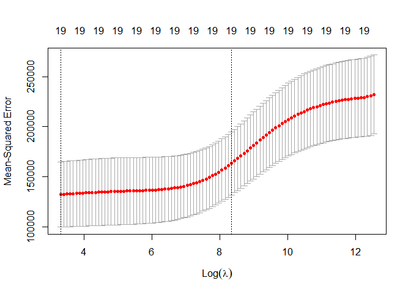
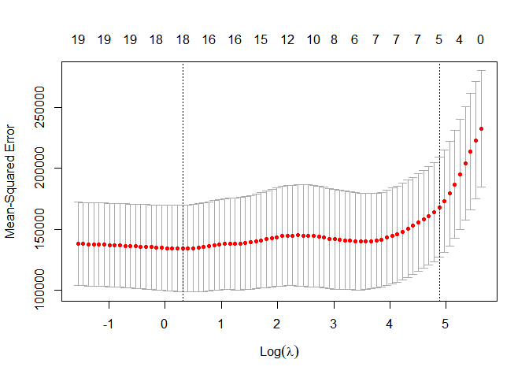

6\. Linear Model Selection and Regularization
================

Best Subset Selection을 위해 subset selection, regularization, dimension
reduction

  - subset selection: foward stepwise selection, backward stepwise
    selection, hybrid(or stepwise) selection
  - Cp(단순 scale의 추가가 AIC라 유사함), BIC, Adjusted-R^2로 비교하는데, BIC를 제일 선호함.
  - Loss나 Loss + Panelty로 구성됨.
  - regularization: ridge regression, the lasso
  - dimension reduction: pcr(pca regression, unsupervised) and pls
  - PLS (Partial Least Squares): supervised, first principal component
    is scaling sum

### pre-requires

``` r
library(leaps)      ## regsubsets()
library(glmnet)     ## glmnet()
library(pls)        ## pcr(), plsr()
data(Hitters, package = "ISLR")
```

discard unknown NA(Not Available)

``` r
Hitters = na.omit(Hitters)
dim(Hitters)
```

    ## [1] 263  20

``` r
## sum(is.na(Hitters$Salary))
```

store unique data sets.

``` r
write.csv(Hitters, "Hitters.csv", row.names = F, quote = F)
```

-----

### 1\. Best Subset Selection

  - SSE로 판단, lm과 비슷, summary로 확인함.

<!-- end list -->

``` r
regfit.full = regsubsets(Salary~., Hitters, nvmax = 19)
reg.summary = summary(regfit.full)
```

모형 변수 갯수 19개로 고정

``` r
names(reg.summary)
```

    ## [1] "which"  "rsq"    "rss"    "adjr2"  "cp"     "bic"    "outmat" "obj"

``` r
reg.summary$rsq
```

    ##  [1] 0.3214501 0.4252237 0.4514294 0.4754067 0.4908036 0.5087146 0.5141227
    ##  [8] 0.5285569 0.5346124 0.5404950 0.5426153 0.5436302 0.5444570 0.5452164
    ## [15] 0.5454692 0.5457656 0.5459518 0.5460945 0.5461159

변수 추가로 증가하는 R-squared 한눈에 보기

##### plot으로 summary 한눈에 보기

``` r
par(mfrow = c(2,2))
plot(reg.summary$rss, xlab = "Number of Variables", ylab = "RSS", type = 'l')
## plot(regfit.full, scale = "r2")

plot(reg.summary$adjr2, xlab = "Number of Variables", ylab = "Adjusted R-squared", type = 'l')
points(which.max(reg.summary$adjr2), reg.summary$adjr2[which.max(reg.summary$adjr2)], col = "red", cex = 2, pch = 20)
## plot(regfit.full, scale = "adjr2")

plot(reg.summary$cp, xlab = "Number of Variables", ylab = "Cp", type = 'l')
points(which.min(reg.summary$cp), reg.summary$cp[which.min(reg.summary$cp)], col = "red", cex = 2, pch = 20)
## plot(regfit.full, scale = "Cp")

plot(reg.summary$bic, xlab = "Number of Variables", ylab = "BIC", type = 'l')
points(which.min(reg.summary$bic), reg.summary$bic[which.min(reg.summary$bic)], col = "red", cex = 2, pch = 20)
```


``` r
## plot(regfit.full, scale = "bic")
```

##### bic를 지표로 선정해보자.

``` r
coef(regfit.full, which.min(reg.summary$bic))
```

    ##  (Intercept)        AtBat         Hits        Walks         CRBI    DivisionW 
    ##   91.5117981   -1.8685892    7.6043976    3.6976468    0.6430169 -122.9515338 
    ##      PutOuts 
    ##    0.2643076

#### 1\. FS: Forward Selection

``` r
regfit.fwd = regsubsets(Salary~., Hitters, nvmax = 19, method = "forward")
summary(regfit.fwd)
```

    ## Subset selection object
    ## Call: regsubsets.formula(Salary ~ ., Hitters, nvmax = 19, method = "forward")
    ## 19 Variables  (and intercept)
    ##            Forced in Forced out
    ## AtBat          FALSE      FALSE
    ## Hits           FALSE      FALSE
    ## HmRun          FALSE      FALSE
    ## Runs           FALSE      FALSE
    ## RBI            FALSE      FALSE
    ## Walks          FALSE      FALSE
    ## Years          FALSE      FALSE
    ## CAtBat         FALSE      FALSE
    ## CHits          FALSE      FALSE
    ## CHmRun         FALSE      FALSE
    ## CRuns          FALSE      FALSE
    ## CRBI           FALSE      FALSE
    ## CWalks         FALSE      FALSE
    ## LeagueN        FALSE      FALSE
    ## DivisionW      FALSE      FALSE
    ## PutOuts        FALSE      FALSE
    ## Assists        FALSE      FALSE
    ## Errors         FALSE      FALSE
    ## NewLeagueN     FALSE      FALSE
    ## 1 subsets of each size up to 19
    ## Selection Algorithm: forward
    ##           AtBat Hits HmRun Runs RBI Walks Years CAtBat CHits CHmRun CRuns CRBI
    ## 1  ( 1 )  " "   " "  " "   " "  " " " "   " "   " "    " "   " "    " "   "*" 
    ## 2  ( 1 )  " "   "*"  " "   " "  " " " "   " "   " "    " "   " "    " "   "*" 
    ## 3  ( 1 )  " "   "*"  " "   " "  " " " "   " "   " "    " "   " "    " "   "*" 
    ## 4  ( 1 )  " "   "*"  " "   " "  " " " "   " "   " "    " "   " "    " "   "*" 
    ## 5  ( 1 )  "*"   "*"  " "   " "  " " " "   " "   " "    " "   " "    " "   "*" 
    ## 6  ( 1 )  "*"   "*"  " "   " "  " " "*"   " "   " "    " "   " "    " "   "*" 
    ## 7  ( 1 )  "*"   "*"  " "   " "  " " "*"   " "   " "    " "   " "    " "   "*" 
    ## 8  ( 1 )  "*"   "*"  " "   " "  " " "*"   " "   " "    " "   " "    "*"   "*" 
    ## 9  ( 1 )  "*"   "*"  " "   " "  " " "*"   " "   "*"    " "   " "    "*"   "*" 
    ## 10  ( 1 ) "*"   "*"  " "   " "  " " "*"   " "   "*"    " "   " "    "*"   "*" 
    ## 11  ( 1 ) "*"   "*"  " "   " "  " " "*"   " "   "*"    " "   " "    "*"   "*" 
    ## 12  ( 1 ) "*"   "*"  " "   "*"  " " "*"   " "   "*"    " "   " "    "*"   "*" 
    ## 13  ( 1 ) "*"   "*"  " "   "*"  " " "*"   " "   "*"    " "   " "    "*"   "*" 
    ## 14  ( 1 ) "*"   "*"  "*"   "*"  " " "*"   " "   "*"    " "   " "    "*"   "*" 
    ## 15  ( 1 ) "*"   "*"  "*"   "*"  " " "*"   " "   "*"    "*"   " "    "*"   "*" 
    ## 16  ( 1 ) "*"   "*"  "*"   "*"  "*" "*"   " "   "*"    "*"   " "    "*"   "*" 
    ## 17  ( 1 ) "*"   "*"  "*"   "*"  "*" "*"   " "   "*"    "*"   " "    "*"   "*" 
    ## 18  ( 1 ) "*"   "*"  "*"   "*"  "*" "*"   "*"   "*"    "*"   " "    "*"   "*" 
    ## 19  ( 1 ) "*"   "*"  "*"   "*"  "*" "*"   "*"   "*"    "*"   "*"    "*"   "*" 
    ##           CWalks LeagueN DivisionW PutOuts Assists Errors NewLeagueN
    ## 1  ( 1 )  " "    " "     " "       " "     " "     " "    " "       
    ## 2  ( 1 )  " "    " "     " "       " "     " "     " "    " "       
    ## 3  ( 1 )  " "    " "     " "       "*"     " "     " "    " "       
    ## 4  ( 1 )  " "    " "     "*"       "*"     " "     " "    " "       
    ## 5  ( 1 )  " "    " "     "*"       "*"     " "     " "    " "       
    ## 6  ( 1 )  " "    " "     "*"       "*"     " "     " "    " "       
    ## 7  ( 1 )  "*"    " "     "*"       "*"     " "     " "    " "       
    ## 8  ( 1 )  "*"    " "     "*"       "*"     " "     " "    " "       
    ## 9  ( 1 )  "*"    " "     "*"       "*"     " "     " "    " "       
    ## 10  ( 1 ) "*"    " "     "*"       "*"     "*"     " "    " "       
    ## 11  ( 1 ) "*"    "*"     "*"       "*"     "*"     " "    " "       
    ## 12  ( 1 ) "*"    "*"     "*"       "*"     "*"     " "    " "       
    ## 13  ( 1 ) "*"    "*"     "*"       "*"     "*"     "*"    " "       
    ## 14  ( 1 ) "*"    "*"     "*"       "*"     "*"     "*"    " "       
    ## 15  ( 1 ) "*"    "*"     "*"       "*"     "*"     "*"    " "       
    ## 16  ( 1 ) "*"    "*"     "*"       "*"     "*"     "*"    " "       
    ## 17  ( 1 ) "*"    "*"     "*"       "*"     "*"     "*"    "*"       
    ## 18  ( 1 ) "*"    "*"     "*"       "*"     "*"     "*"    "*"       
    ## 19  ( 1 ) "*"    "*"     "*"       "*"     "*"     "*"    "*"

#### 2\. BE: Backward Elimination

``` r
regfit.bwd = regsubsets(Salary~., Hitters, nvmax = 9, method = "backward")
summary(regfit.bwd)
```

    ## Subset selection object
    ## Call: regsubsets.formula(Salary ~ ., Hitters, nvmax = 9, method = "backward")
    ## 19 Variables  (and intercept)
    ##            Forced in Forced out
    ## AtBat          FALSE      FALSE
    ## Hits           FALSE      FALSE
    ## HmRun          FALSE      FALSE
    ## Runs           FALSE      FALSE
    ## RBI            FALSE      FALSE
    ## Walks          FALSE      FALSE
    ## Years          FALSE      FALSE
    ## CAtBat         FALSE      FALSE
    ## CHits          FALSE      FALSE
    ## CHmRun         FALSE      FALSE
    ## CRuns          FALSE      FALSE
    ## CRBI           FALSE      FALSE
    ## CWalks         FALSE      FALSE
    ## LeagueN        FALSE      FALSE
    ## DivisionW      FALSE      FALSE
    ## PutOuts        FALSE      FALSE
    ## Assists        FALSE      FALSE
    ## Errors         FALSE      FALSE
    ## NewLeagueN     FALSE      FALSE
    ## 1 subsets of each size up to 9
    ## Selection Algorithm: backward
    ##          AtBat Hits HmRun Runs RBI Walks Years CAtBat CHits CHmRun CRuns CRBI
    ## 1  ( 1 ) " "   " "  " "   " "  " " " "   " "   " "    " "   " "    "*"   " " 
    ## 2  ( 1 ) " "   "*"  " "   " "  " " " "   " "   " "    " "   " "    "*"   " " 
    ## 3  ( 1 ) " "   "*"  " "   " "  " " " "   " "   " "    " "   " "    "*"   " " 
    ## 4  ( 1 ) "*"   "*"  " "   " "  " " " "   " "   " "    " "   " "    "*"   " " 
    ## 5  ( 1 ) "*"   "*"  " "   " "  " " "*"   " "   " "    " "   " "    "*"   " " 
    ## 6  ( 1 ) "*"   "*"  " "   " "  " " "*"   " "   " "    " "   " "    "*"   " " 
    ## 7  ( 1 ) "*"   "*"  " "   " "  " " "*"   " "   " "    " "   " "    "*"   " " 
    ## 8  ( 1 ) "*"   "*"  " "   " "  " " "*"   " "   " "    " "   " "    "*"   "*" 
    ## 9  ( 1 ) "*"   "*"  " "   " "  " " "*"   " "   "*"    " "   " "    "*"   "*" 
    ##          CWalks LeagueN DivisionW PutOuts Assists Errors NewLeagueN
    ## 1  ( 1 ) " "    " "     " "       " "     " "     " "    " "       
    ## 2  ( 1 ) " "    " "     " "       " "     " "     " "    " "       
    ## 3  ( 1 ) " "    " "     " "       "*"     " "     " "    " "       
    ## 4  ( 1 ) " "    " "     " "       "*"     " "     " "    " "       
    ## 5  ( 1 ) " "    " "     " "       "*"     " "     " "    " "       
    ## 6  ( 1 ) " "    " "     "*"       "*"     " "     " "    " "       
    ## 7  ( 1 ) "*"    " "     "*"       "*"     " "     " "    " "       
    ## 8  ( 1 ) "*"    " "     "*"       "*"     " "     " "    " "       
    ## 9  ( 1 ) "*"    " "     "*"       "*"     " "     " "    " "

``` r
coef(regfit.full, 7)
```

    ##  (Intercept)         Hits        Walks       CAtBat        CHits       CHmRun 
    ##   79.4509472    1.2833513    3.2274264   -0.3752350    1.4957073    1.4420538 
    ##    DivisionW      PutOuts 
    ## -129.9866432    0.2366813

``` r
coef(regfit.fwd, 7)
```

    ##  (Intercept)        AtBat         Hits        Walks         CRBI       CWalks 
    ##  109.7873062   -1.9588851    7.4498772    4.9131401    0.8537622   -0.3053070 
    ##    DivisionW      PutOuts 
    ## -127.1223928    0.2533404

``` r
coef(regfit.bwd, 7)
```

    ##  (Intercept)        AtBat         Hits        Walks        CRuns       CWalks 
    ##  105.6487488   -1.9762838    6.7574914    6.0558691    1.1293095   -0.7163346 
    ##    DivisionW      PutOuts 
    ## -116.1692169    0.3028847

그냥 각 subset selection에서 어떤 순서대로 들어왔는지 보려고 찍는 거.

#### 3\. Choose model using Validation set or Cross-Validation

``` r
## set.seed(1)
train = sample(c(T, F), nrow(Hitters), rep = T)
test = (!train)
```

Hitters의 행수만큼 t, f 랜덤 반복으로 생성

``` r
regfit.best = regsubsets(Salary~., Hitters[train,], nvmax = 19)
test.mat = model.matrix(Salary~., Hitters[test,])
val.errors = rep(NA, 19)
for(i in 1:19) {
  coefi = coef(regfit.best, id = i)
  pred = test.mat[, names(coefi)] %*% coefi
  val.errors[i] = mean((Hitters$Salary[test] - pred)^2)
}; rm(i)
```

``` r
val.errors
```

    ##  [1] 196014.0 173174.3 166121.9 160902.9 155443.3 162018.9 162536.7 164660.7
    ##  [9] 163511.2 160549.5 154266.4 149910.4 152369.1 152760.7 153304.3 154004.2
    ## [17] 154450.4 154981.1 154465.5

``` r
coef(regfit.best, which.min(val.errors))
```

    ## (Intercept)       AtBat        Hits       HmRun       Walks       Years 
    ## -72.1388698  -0.7272083   5.0523282  -5.9465642   2.7387733  15.3712472 
    ##      CAtBat       CRuns        CRBI      CWalks     LeagueN   DivisionW 
    ##  -0.2214526   1.2690904   1.2249595  -0.5408976  63.1476707 -48.6095678 
    ##     PutOuts 
    ##   0.1402312

어후 생각보다 beta\_0랑 몇 개 회귀계수가 차이가 심하네, 그리고 errors의 최대값이 변해서 보여주는 회귀계수 수도 자꾸
변함.

##### custom predict for regsubsets function

``` r
predict.regsubsets = function(object, newdata, id, ...) {
  form = as.formula(object$call[[2]])
  mat = model.matrix(form, newdata)
  coefi = coef(object, id = id)
  xvars = names(coefi)
  mat[, xvars] %*% coefi
}
```

``` r
regfit.best = regsubsets(Salary~., Hitters, nvmax = 19)
coef(regfit.best, which.min(val.errors))
```

    ##  (Intercept)        AtBat         Hits         Runs        Walks       CAtBat 
    ##  135.5194919   -2.0563475    7.5064072   -1.7965622    6.0619776   -0.1524448 
    ##        CRuns         CRBI       CWalks      LeagueN    DivisionW      PutOuts 
    ##    1.5589219    0.7775813   -0.8350722   39.0865444 -112.6442519    0.2842332 
    ##      Assists 
    ##    0.2434442

##### select model when different size

``` r
## set.seed(1)
k = 10
folds = sample(1:k, nrow(Hitters), replace = T)
cv.errors = matrix(NA, k, 19, dimnames = list(NULL, paste(1:19)))

for(i in 1:k) {
  best.fit = regsubsets(Salary~., Hitters[folds != i,], nvmax = 19)
  for(j in 1:19) {
    pred = predict(best.fit, Hitters[folds == i,], id = j)
    cv.errors[i, j] = mean((Hitters$Salary[folds == i] - pred)^2)
  }
}; rm(i); rm(j)
```

``` r
mean.cv.errors = apply(cv.errors, 2, mean)
mean.cv.errors
```

    ##        1        2        3        4        5        6        7        8 
    ## 151415.7 133241.7 137678.4 135643.8 134219.0 124320.2 126449.9 115294.7 
    ##        9       10       11       12       13       14       15       16 
    ## 114014.1 108798.9 109379.7 112030.3 113521.6 113869.3 114769.3 115060.4 
    ##       17       18       19 
    ## 115309.0 115343.2 115155.2

``` r
par(mfrow = c(1,1))
plot(mean.cv.errors, type = 'b')
```


11개가 최솟점이긴 하네.

``` r
reg.best = regsubsets(Salary~., Hitters, nvmax = 19)
coef(reg.best, 11)
```

    ##  (Intercept)        AtBat         Hits        Walks       CAtBat        CRuns 
    ##  135.7512195   -2.1277482    6.9236994    5.6202755   -0.1389914    1.4553310 
    ##         CRBI       CWalks      LeagueN    DivisionW      PutOuts      Assists 
    ##    0.7852528   -0.8228559   43.1116152 -111.1460252    0.2894087    0.2688277

-----

### 2\. Ridge Reggresion and the Lasso

와 역시 프로그래밍이 짱이야 alpha = 0이면 ridge고, 1이면 lasso야?<br /> 대단하다, 진짜 어지간히 하나로
만들고 싶었나보다.

``` r
X = model.matrix(Salary~., Hitters)[, -1]
y = Hitters$Salary
```

X: model의 예측변수들을 자동으로 수치화(더미화 포함)해서 matrix로 표현.

#### 1\. Ridge

``` r
grid = 10^seq(10, -2, length = 100)
ridge.mod = glmnet(X, y, alpha = 0, lambda = grid)
```

  - 원래라면 함수가 자동으로 lambda를 설정했겠지만, 지금은 강제적으로 grid 영역 안에서 찾으라고 설정함.
  - 또 glmnet 함수는 자동으로 표준화해서 사용하므로, 이 기능이 필요없다면 standardize = F를 하자.

<!-- end list -->

``` r
## dim(coef(ridge.mod))
ridge.mod$lambda[50]
```

    ## [1] 11497.57

``` r
coef(ridge.mod)[, 50]
```

    ##   (Intercept)         AtBat          Hits         HmRun          Runs 
    ## 407.356050200   0.036957182   0.138180344   0.524629976   0.230701523 
    ##           RBI         Walks         Years        CAtBat         CHits 
    ##   0.239841459   0.289618741   1.107702929   0.003131815   0.011653637 
    ##        CHmRun         CRuns          CRBI        CWalks       LeagueN 
    ##   0.087545670   0.023379882   0.024138320   0.025015421   0.085028114 
    ##     DivisionW       PutOuts       Assists        Errors    NewLeagueN 
    ##  -6.215440973   0.016482577   0.002612988  -0.020502690   0.301433531

``` r
sqrt(sum(coef(ridge.mod)[-1, 50]^2))
```

    ## [1] 6.360612

``` r
ridge.mod$lambda[60]
```

    ## [1] 705.4802

``` r
coef(ridge.mod)[, 60]
```

    ##  (Intercept)        AtBat         Hits        HmRun         Runs          RBI 
    ##  54.32519950   0.11211115   0.65622409   1.17980910   0.93769713   0.84718546 
    ##        Walks        Years       CAtBat        CHits       CHmRun        CRuns 
    ##   1.31987948   2.59640425   0.01083413   0.04674557   0.33777318   0.09355528 
    ##         CRBI       CWalks      LeagueN    DivisionW      PutOuts      Assists 
    ##   0.09780402   0.07189612  13.68370191 -54.65877750   0.11852289   0.01606037 
    ##       Errors   NewLeagueN 
    ##  -0.70358655   8.61181213

``` r
sqrt(sum(coef(ridge.mod)[-1, 60]^2))
```

    ## [1] 57.11001

확실히 lambda가 커지니까 coef가 작아지긴 하네.

``` r
predict(ridge.mod, s = 50, type = "coefficients")[1:20,]
```

    ##   (Intercept)         AtBat          Hits         HmRun          Runs 
    ##  4.876610e+01 -3.580999e-01  1.969359e+00 -1.278248e+00  1.145892e+00 
    ##           RBI         Walks         Years        CAtBat         CHits 
    ##  8.038292e-01  2.716186e+00 -6.218319e+00  5.447837e-03  1.064895e-01 
    ##        CHmRun         CRuns          CRBI        CWalks       LeagueN 
    ##  6.244860e-01  2.214985e-01  2.186914e-01 -1.500245e-01  4.592589e+01 
    ##     DivisionW       PutOuts       Assists        Errors    NewLeagueN 
    ## -1.182011e+02  2.502322e-01  1.215665e-01 -3.278600e+00 -9.496680e+00

#### validation set approach

``` r
## set.seed(1)
train = sample(1:nrow(X), nrow(X)/2)
test = (-train)
y.test = y[test]
```

``` r
ridge.mod = glmnet(X[train,], y[train], alpha = 0, lambda = grid, thresh = 1e-12)
```

##### MSE hat

``` r
mean((mean(y[train]) - y.test)^2)
```

    ## [1] 177850.2

``` r
ridge.pred = predict(ridge.mod, s = 4, newx = X[test,])
mean((ridge.pred - y.test)^2)
```

    ## [1] 108239.6

``` r
ridge.pred = predict(ridge.mod, s = 1e10, newx = X[test,])
mean((ridge.pred - y.test)^2)
```

    ## [1] 177850.1

``` r
ridge.pred = predict(ridge.mod, s = 0, newx = X[test,])
mean((ridge.pred - y.test)^2)
```

  - 원래라면 s를 완벽하게 0에 맞추는 옵션이었던 거 같은데, X와 y에 조정을 해야 하는지 안된다고 하네.

<!-- end list -->

``` r
lm(y ~ X, subset = train)
```

    ## 
    ## Call:
    ## lm(formula = y ~ X, subset = train)
    ## 
    ## Coefficients:
    ## (Intercept)       XAtBat        XHits       XHmRun        XRuns         XRBI  
    ##    225.2710      -1.2459       2.5196       7.5516       2.6381      -1.0935  
    ##      XWalks       XYears      XCAtBat       XCHits      XCHmRun       XCRuns  
    ##      3.7680      -4.9133      -0.5373       1.8119       0.3674       0.9568  
    ##       XCRBI      XCWalks     XLeagueN   XDivisionW     XPutOuts     XAssists  
    ##      0.3330      -0.5412     -25.7487    -132.4662       0.3551       0.5416  
    ##     XErrors  XNewLeagueN  
    ##     -6.4488      56.3378

``` r
predict(ridge.mod, s = 0, type = "coefficients")[1:20,] ## exact = T
```

    ##  (Intercept)        AtBat         Hits        HmRun         Runs          RBI 
    ##  225.3772206   -1.2579356    2.5763843    7.5800212    2.5998357   -1.1016499 
    ##        Walks        Years       CAtBat        CHits       CHmRun        CRuns 
    ##    3.7953162   -5.1026991   -0.5314275    1.7848479    0.3404289    0.9712239 
    ##         CRBI       CWalks      LeagueN    DivisionW      PutOuts      Assists 
    ##    0.3449538   -0.5493695  -25.9030058 -132.4514142    0.3549658    0.5397729 
    ##       Errors   NewLeagueN 
    ##   -6.4374649   56.5884162

``` r
## set.seed(1)
cv.out = cv.glmnet(X[train,], y[train], alpha = 0)
plot(cv.out)
```



``` r
bestlam = cv.out$lambda.min
bestlam
```

    ## [1] 27.55538

  - 최적 ridge의 lambda 범위를 모아다 최솟값을 가져온 건데, 왜 seed가 필요할까.
  - 내부적으로 lambda를 찾을 때 resampling를 사용하는 건가.

<!-- end list -->

``` r
ridge.pred = predict(ridge.mod, s = bestlam, newx = X[test,])
mean((ridge.pred - y.test)^2)
```

    ## [1] 105698.4

##### lambda 구역을 설정하지 않은 적합을 해보자.

``` r
out = glmnet(X, y, alpha = 0)
predict(out, type = "coefficients", s = bestlam)[1:20,]
```

    ##   (Intercept)         AtBat          Hits         HmRun          Runs 
    ##  7.732447e+01 -6.408095e-01  2.666308e+00 -1.384049e+00  1.039996e+00 
    ##           RBI         Walks         Years        CAtBat         CHits 
    ##  7.281297e-01  3.296658e+00 -8.787386e+00 -1.202262e-04  1.326778e-01 
    ##        CHmRun         CRuns          CRBI        CWalks       LeagueN 
    ##  6.911234e-01  2.853960e-01  2.525259e-01 -2.635069e-01  5.249964e+01 
    ##     DivisionW       PutOuts       Assists        Errors    NewLeagueN 
    ## -1.224945e+02  2.626489e-01  1.641986e-01 -3.651728e+00 -1.722620e+01

정말 ridge는 변수를 버릴 생각을 하지 않는구나.

#### The Lasso

``` r
lasso.mod = glmnet(X[train,], y[train], alpha = 1, lambda = grid)
plot(lasso.mod)
```

    ## Warning in regularize.values(x, y, ties, missing(ties)): collapsing to unique
    ## 'x' values


와우. 누가 선 긋다가 실수한 것처럼 여기저기 막 나가네.

``` r
## set.seed(1)
cv.out = cv.glmnet(X[train,], y[train], alpha = 1)
plot(cv.out)
```



``` r
bestlam = cv.out$lambda.min
lasso.pred = predict(lasso.mod, s = bestlam, newx = X[test,])
mean((lasso.pred - y.test)^2)
```

    ## [1] 111401.8

확실히 ridge랑 비슷한 값인 건만 알겠음.

``` r
out = glmnet(X, y , alpha = 1, lambda = grid)
lasso.coef = predict(out, type = "coefficients", s = bestlam)[1:20,]
lasso.coef
```

    ##   (Intercept)         AtBat          Hits         HmRun          Runs 
    ##  148.47005353   -1.86963995    6.48023063    0.74318790   -0.43858112 
    ##           RBI         Walks         Years        CAtBat         CHits 
    ##    0.00000000    5.37241599   -8.88140804   -0.03796356    0.00000000 
    ##        CHmRun         CRuns          CRBI        CWalks       LeagueN 
    ##    0.38432164    0.95563867    0.49268060   -0.68200359   40.97231574 
    ##     DivisionW       PutOuts       Assists        Errors    NewLeagueN 
    ## -117.61744368    0.28096830    0.26047170   -2.66957999   -5.33000840

오 확실히 0인 건 있네. 랜덤성에 의해 12개가 0인 건 아니지만.

-----

### 3\. PCR and PLS Regression

#### PCR: Principal Component Analysis Regression

``` r
## set.seed(2)
pcr.fit = pcr(Salary~., data = Hitters, scale = T, validation = "CV")
summary(pcr.fit)
```

    ## Data:    X dimension: 263 19 
    ##  Y dimension: 263 1
    ## Fit method: svdpc
    ## Number of components considered: 19
    ## 
    ## VALIDATION: RMSEP
    ## Cross-validated using 10 random segments.
    ##        (Intercept)  1 comps  2 comps  3 comps  4 comps  5 comps  6 comps
    ## CV             452    351.6    350.2    350.5    347.7    347.6    345.2
    ## adjCV          452    351.3    349.9    350.1    347.3    347.0    344.3
    ##        7 comps  8 comps  9 comps  10 comps  11 comps  12 comps  13 comps
    ## CV       345.5    346.9    349.0     349.8     350.6     353.1     354.5
    ## adjCV    344.6    345.9    347.9     348.6     349.2     351.7     352.9
    ##        14 comps  15 comps  16 comps  17 comps  18 comps  19 comps
    ## CV        349.3     349.4     339.8     339.0     337.7     342.4
    ## adjCV     347.6     347.7     338.1     337.3     335.9     340.3
    ## 
    ## TRAINING: % variance explained
    ##         1 comps  2 comps  3 comps  4 comps  5 comps  6 comps  7 comps  8 comps
    ## X         38.31    60.16    70.84    79.03    84.29    88.63    92.26    94.96
    ## Salary    40.63    41.58    42.17    43.22    44.90    46.48    46.69    46.75
    ##         9 comps  10 comps  11 comps  12 comps  13 comps  14 comps  15 comps
    ## X         96.28     97.26     97.98     98.65     99.15     99.47     99.75
    ## Salary    46.86     47.76     47.82     47.85     48.10     50.40     50.55
    ##         16 comps  17 comps  18 comps  19 comps
    ## X          99.89     99.97     99.99    100.00
    ## Salary     53.01     53.85     54.61     54.61

> pcr( ), 조건이 많은 lm, 얘는 data를 써줘야 인식하는 약간 poor한 함수다.

``` r
validationplot(pcr.fit, val.type = "MSEP")
```


오홍, pca 때의 누적 eigen value 그래프 같네.

``` r
## set.seed(1)
pcr.fit = pcr(Salary~., data = Hitters, subset = train, scale = T, validation = "CV")
validationplot(pcr.fit, val.type = "MSEP")
```


##### pc가 7개일 때 90%을 넘은 걸 보고 7을 선택한 듯 보임.

``` r
pcr.pred = predict(pcr.fit, X[test,], ncomp = 7)
mean((pcr.pred - y.test)^2)
```

    ## [1] 106402.2

``` r
pcr.fit = pcr(y ~ X, scale = T, ncomp = 7)
summary(pcr.fit)
```

    ## Data:    X dimension: 263 19 
    ##  Y dimension: 263 1
    ## Fit method: svdpc
    ## Number of components considered: 7
    ## TRAINING: % variance explained
    ##    1 comps  2 comps  3 comps  4 comps  5 comps  6 comps  7 comps
    ## X    38.31    60.16    70.84    79.03    84.29    88.63    92.26
    ## y    40.63    41.58    42.17    43.22    44.90    46.48    46.69

#### PLS: Partial Least Squares

``` r
## set.seed(1)
pls.fit = plsr(Salary~., data = Hitters, subset = train, scale = T, validation = "CV")
summary(pls.fit)
```

    ## Data:    X dimension: 131 19 
    ##  Y dimension: 131 1
    ## Fit method: kernelpls
    ## Number of components considered: 19
    ## 
    ## VALIDATION: RMSEP
    ## Cross-validated using 10 random segments.
    ##        (Intercept)  1 comps  2 comps  3 comps  4 comps  5 comps  6 comps
    ## CV           481.8    374.2    378.2    384.2    386.9    391.5    388.4
    ## adjCV        481.8    373.4    376.9    381.7    383.9    386.5    382.9
    ##        7 comps  8 comps  9 comps  10 comps  11 comps  12 comps  13 comps
    ## CV       383.7    381.9    378.4     377.3     384.7     381.2     383.4
    ## adjCV    378.5    377.2    374.3     372.6     379.6     376.4     378.6
    ##        14 comps  15 comps  16 comps  17 comps  18 comps  19 comps
    ## CV        378.6     374.6     374.0     375.9     377.3     375.9
    ## adjCV     373.9     370.3     369.7     371.4     372.8     371.3
    ## 
    ## TRAINING: % variance explained
    ##         1 comps  2 comps  3 comps  4 comps  5 comps  6 comps  7 comps  8 comps
    ## X         41.38    54.24    66.42    72.17    75.40    77.87     81.3    86.88
    ## Salary    45.06    49.42    51.69    54.17    57.31    58.87     59.4    59.87
    ##         9 comps  10 comps  11 comps  12 comps  13 comps  14 comps  15 comps
    ## X         92.69     93.64     96.53     97.26     98.46     98.70     99.03
    ## Salary    60.19     60.68     60.90     61.43     61.58     62.04     62.22
    ##         16 comps  17 comps  18 comps  19 comps
    ## X          99.48     99.76     99.97    100.00
    ## Salary     62.34     62.47     62.50     62.71

> plsr( ), 얘도 data는 “data=”으로 써야 하는 poor한 함수군요.

``` r
validationplot(pls.fit, val.type = "MSEP")
```


##### validation 그림이 pc를 2로 하는 게 적정임을 보여줌.

``` r
pls.pred = predict(pls.fit, X[test,], ncomp = 2)
mean((pls.pred - y.test)^2)
```

    ## [1] 114018

``` r
pls.fit = plsr(Salary~., data = Hitters, scale = T, ncomp = 2)
summary(pls.fit)
```

    ## Data:    X dimension: 263 19 
    ##  Y dimension: 263 1
    ## Fit method: kernelpls
    ## Number of components considered: 2
    ## TRAINING: % variance explained
    ##         1 comps  2 comps
    ## X         38.08    51.03
    ## Salary    43.05    46.40
