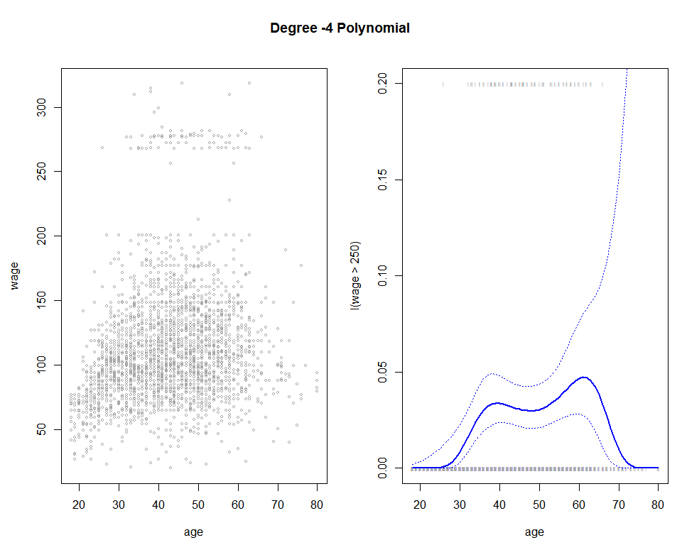
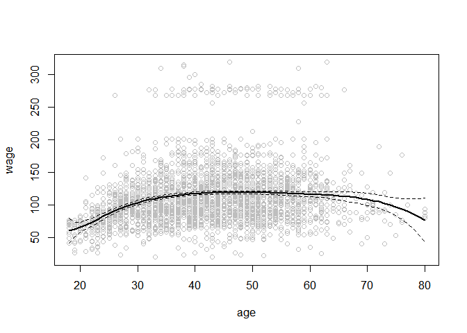
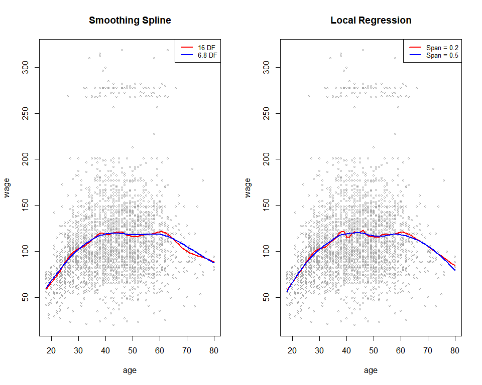

7\. Moving Beyond Linearity
================

선형을 일부 버리되, 설명력을 높이자는 계획이었으나

  - polynomial: 다항 회귀, 해석력 감소
  - Step Function: 구간 linear, 구간 poly, 일부 불연속, 미분 불가능으로 poly의 경우에는 한 단계
    낮추거나 함.
  - Spline

### pre-requires

``` r
## library(ISLR)
library(splines)    ## smooth.spline(), ns()
data(Wage, package = "ISLR")
attach(Wage)
```

store unique data sets.

``` r
write.csv(Wage, "Wage.csv", row.names = F, quote = F)
```

-----

### 1\. Polynomial Regression and Step Functions

``` r
fit = lm(wage ~ poly(age, 4))
coef(summary(fit))
```

    ##                 Estimate Std. Error    t value     Pr(>|t|)
    ## (Intercept)    111.70361  0.7287409 153.283015 0.000000e+00
    ## poly(age, 4)1  447.06785 39.9147851  11.200558 1.484604e-28
    ## poly(age, 4)2 -478.31581 39.9147851 -11.983424 2.355831e-32
    ## poly(age, 4)3  125.52169 39.9147851   3.144742 1.678622e-03
    ## poly(age, 4)4  -77.91118 39.9147851  -1.951938 5.103865e-02

``` r
age.grid = seq(range(age)[1], range(age)[2])
preds = predict(fit, newdata = list(age = age.grid), se = T)
se.bands = cbind(preds$fit + 2*preds$se.fit, preds$fit - 2*preds$se.fit)
```

표준 정규분포에서 2차 시그마 구간 구하듯 함.

##### orthogonal vs. non-orthogonal(정확한 명칭 기억나지 않음.)

``` r
fit2 = lm(wage ~ poly(age, 4, raw = T))
coef(summary(fit2))
```

    ##                             Estimate   Std. Error   t value     Pr(>|t|)
    ## (Intercept)            -1.841542e+02 6.004038e+01 -3.067172 0.0021802539
    ## poly(age, 4, raw = T)1  2.124552e+01 5.886748e+00  3.609042 0.0003123618
    ## poly(age, 4, raw = T)2 -5.638593e-01 2.061083e-01 -2.735743 0.0062606446
    ## poly(age, 4, raw = T)3  6.810688e-03 3.065931e-03  2.221409 0.0263977518
    ## poly(age, 4, raw = T)4 -3.203830e-05 1.641359e-05 -1.951938 0.0510386498

not orthogonal polynomials

##### 이런 식으로도 non-orthogonal하게 만들 수 있음.

``` r
fit2a = lm(wage ~ age + I(age^2) + I(age^3) + I(age^4))
coef(fit2a)
```

##### 일단은 orthogonal

``` r
fit2b = lm(wage ~ cbind(age, age^2, age^3, age^4))
coef(fit2b)
```

    ##                        (Intercept) cbind(age, age^2, age^3, age^4)age 
    ##                      -1.841542e+02                       2.124552e+01 
    ##    cbind(age, age^2, age^3, age^4)    cbind(age, age^2, age^3, age^4) 
    ##                      -5.638593e-01                       6.810688e-03 
    ##    cbind(age, age^2, age^3, age^4) 
    ##                      -3.203830e-05

딱히 이쁘게 나오진 않는데.

``` r
preds2 = predict(fit2, newdata = list(age = age.grid), se = T)
max(abs(preds$fit - preds2$fit))
```

    ## [1] 7.81597e-11

``` r
fit.1 = lm(wage ~ age)
fit.2 = lm(wage ~ poly(age, 2))     # quadratic
fit.3 = lm(wage ~ poly(age, 3))     # cubic
fit.4 = lm(wage ~ poly(age, 4))
fit.5 = lm(wage ~ poly(age, 5))
```

R도 이름 i를 인식 못할 테니, 다 써야지 뭐.

``` r
anova(fit.1, fit.2, fit.3, fit.4, fit.5)
```

    ## Analysis of Variance Table
    ## 
    ## Model 1: wage ~ age
    ## Model 2: wage ~ poly(age, 2)
    ## Model 3: wage ~ poly(age, 3)
    ## Model 4: wage ~ poly(age, 4)
    ## Model 5: wage ~ poly(age, 5)
    ##   Res.Df     RSS Df Sum of Sq        F    Pr(>F)    
    ## 1   2998 5022216                                    
    ## 2   2997 4793430  1    228786 143.5931 < 2.2e-16 ***
    ## 3   2996 4777674  1     15756   9.8888  0.001679 ** 
    ## 4   2995 4771604  1      6070   3.8098  0.051046 .  
    ## 5   2994 4770322  1      1283   0.8050  0.369682    
    ## ---
    ## Signif. codes:  0 '***' 0.001 '**' 0.01 '*' 0.05 '.' 0.1 ' ' 1

``` r
coef(summary(fit.5))
```

    ##                 Estimate Std. Error     t value     Pr(>|t|)
    ## (Intercept)    111.70361  0.7287647 153.2780243 0.000000e+00
    ## poly(age, 5)1  447.06785 39.9160847  11.2001930 1.491111e-28
    ## poly(age, 5)2 -478.31581 39.9160847 -11.9830341 2.367734e-32
    ## poly(age, 5)3  125.52169 39.9160847   3.1446392 1.679213e-03
    ## poly(age, 5)4  -77.91118 39.9160847  -1.9518743 5.104623e-02
    ## poly(age, 5)5  -35.81289 39.9160847  -0.8972045 3.696820e-01

anova method works whether or not we used orthogonal polynomials

``` r
fit.1 = lm(wage ~ education + age)
fit.2 = lm(wage ~ education + poly(age, 2))
fit.3 = lm(wage ~ education + poly(age, 3))
anova(fit.1, fit.2, fit.3)
```

    ## Analysis of Variance Table
    ## 
    ## Model 1: wage ~ education + age
    ## Model 2: wage ~ education + poly(age, 2)
    ## Model 3: wage ~ education + poly(age, 3)
    ##   Res.Df     RSS Df Sum of Sq        F Pr(>F)    
    ## 1   2994 3867992                                 
    ## 2   2993 3725395  1    142597 114.6969 <2e-16 ***
    ## 3   2992 3719809  1      5587   4.4936 0.0341 *  
    ## ---
    ## Signif. codes:  0 '***' 0.001 '**' 0.01 '*' 0.05 '.' 0.1 ' ' 1

``` r
fit = glm(I(wage > 250) ~ poly(age, 4), family = binomial)
preds = predict(fit, newdata = list(age = age.grid), se = T)
```

> family 옵션을 통해 y에 대한 예측을 binomial화 할 수 있다.

##### 로짓을 로지스틱으로 수동 변형

``` r
pfit = exp(preds$fit) / (1 + exp(preds$fit))
se.bands.logit = cbind(preds$fit + 2*preds$se.fit, preds$fit - 2*preds$se.fit)
se.bands = exp(se.bands.logit) / (1 + exp(se.bands.logit))
preds = predict(fit, newdata = list(age = age.grid), type = "response", se = T)
```

``` r
par(mfrow = c(1, 2), mar = c(4.5, 4.5, 1, 1), oma = c(0, 0, 4, 0))
plot(age, wage, xlim = range(age), cex = .5, col = "darkgrey")
title("Degree -4 Polynomial", outer = T)
lines(age.grid, preds$fit, lwd = 2, col = "blue")
matlines(age.grid, se.bands, lwd = 1, col = "blue", lty = 3)

plot(age, I(wage > 250), xlim = range(age), type = 'n', ylim = c(0, .2))
points(jitter(age), I((wage > 250)/5), cex = .5, pch = 'l', col = "darkgrey")
lines(age.grid, pfit, lwd = 2, col = "blue")
matlines(age.grid, se.bands, lwd = 1, col = 'blue', lty = 3)
```



  - 설마 oma는 padding을 의미하는 건가.
  - jitter 함수가 뭐였는지 정확히 기억나지는 않는데… rug plot이랑 관련 있음.

##### cut 함수를 이용한 자동 knot 지점 만들기

``` r
table(cut(age, 4))
```

    ## 
    ## (17.9,33.5]   (33.5,49]   (49,64.5] (64.5,80.1] 
    ##         750        1399         779          72

``` r
fit = lm(wage ~ cut(age, 4))
coef(summary(fit))
```

    ##                         Estimate Std. Error   t value     Pr(>|t|)
    ## (Intercept)            94.158392   1.476069 63.789970 0.000000e+00
    ## cut(age, 4)(33.5,49]   24.053491   1.829431 13.148074 1.982315e-38
    ## cut(age, 4)(49,64.5]   23.664559   2.067958 11.443444 1.040750e-29
    ## cut(age, 4)(64.5,80.1]  7.640592   4.987424  1.531972 1.256350e-01

-----

### 2\. Splines

``` r
fit = lm(wage ~ bs(age, knots = c(25, 40, 60)))
pred = predict(fit, newdata = list(age = age.grid), se = T)
```

> bs: basis functions의 knots 정하기 on full data

``` r
plot(age, wage, col = "gray")
lines(age.grid, pred$fit, lwd = 2)
lines(age.grid, pred$fit + 2*pred$se, lty = "dashed")
lines(age.grid, pred$fit - 2*pred$se, lty = "dashed")
```



##### (auto or) compute는 정말 최고야.

``` r
dim(bs(age, knots = c(25, 40, 60)))
```

    ## [1] 3000    6

``` r
dim(bs(age, df = 6))
```

    ## [1] 3000    6

``` r
attr(bs(age, df = 6), "knots")
```

    ##   25%   50%   75% 
    ## 33.75 42.00 51.00

``` r
fit2 = lm(wage ~ ns(age, df = 4))
pred2 = predict(fit2, newdata = list(age = age.grid), se = T)
## lines(age.grid, pred2$fit, col = "red", lwd = 2)
```

> ns: natural spline

  - 원래라면 위에 plot에 line을 추가하는 형식이지만, studio로 만들면서 끊어져버렸다.

<!-- end list -->

``` r
par(mfrow = c(1,2))
fit = smooth.spline(age, wage, df = 16)
fit2 = smooth.spline(age, wage, cv =T)
```

    ## Warning in smooth.spline(age, wage, cv = T): cross-validation with non-unique
    ## 'x' values seems doubtful

``` r
plot(age, wage, xlim = range(age), cex = .5, col = "darkgrey")
title("Smoothing Spline")
lines(fit, col = "red", lwd = 2)
lines(fit2, col = "blue", lwd = 2)
legend("topright", legend = c("16 DF", "6.8 DF"), col = c("red", "blue"), lty = 1, lwd = 2, cex = .8)

fit = loess(wage ~ age, span = .2)
fit2 = loess(wage ~ age, span = .5)
plot(age, wage, xlim = range(age), cex = .5, col = "darkgrey")
title("Local Regression")
lines(age.grid, predict(fit, data.frame(age = age.grid)), col = "red", lwd = 2)
lines(age.grid, predict(fit2, data.frame(age = age.grid)), col = "blue", lwd = 2)
legend("topright", legend = c("Span = 0.2", "Span = 0.5"), col = c("red", "blue"), lty = 1, lwd = 2, cex = .8)
```


locfit library
