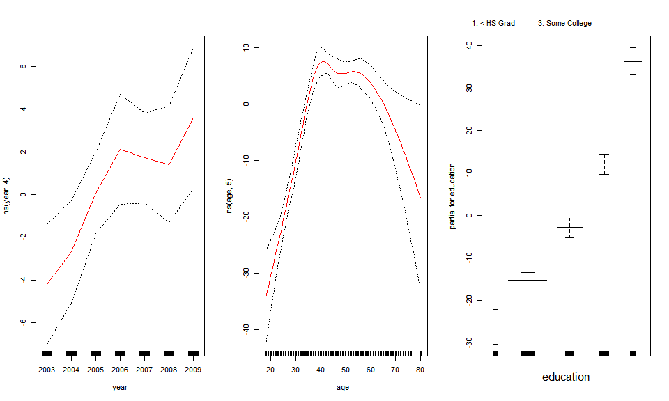
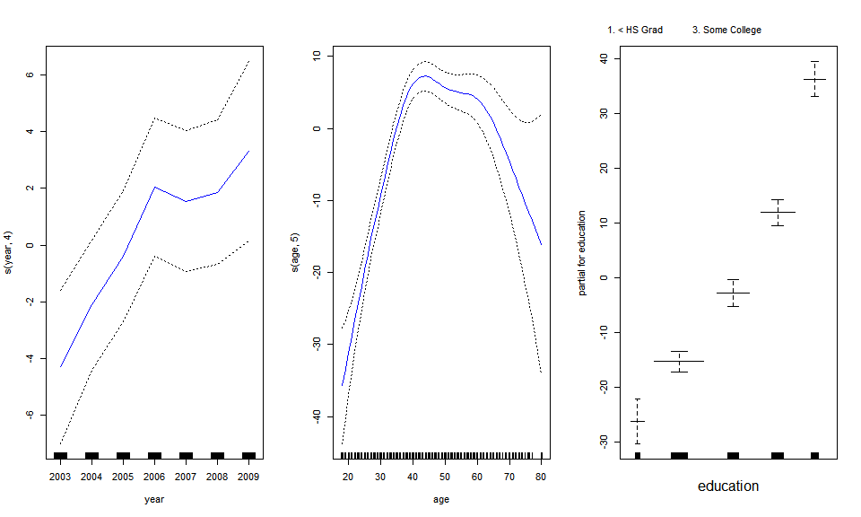
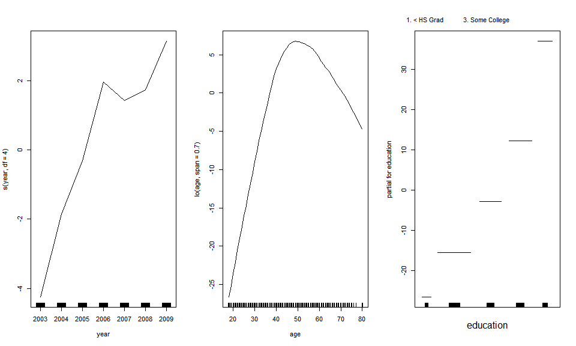
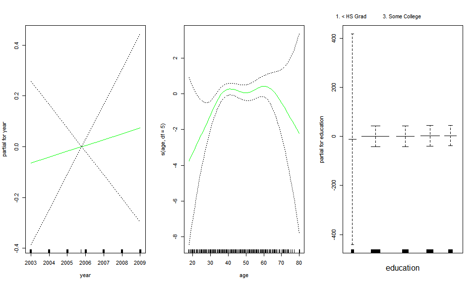
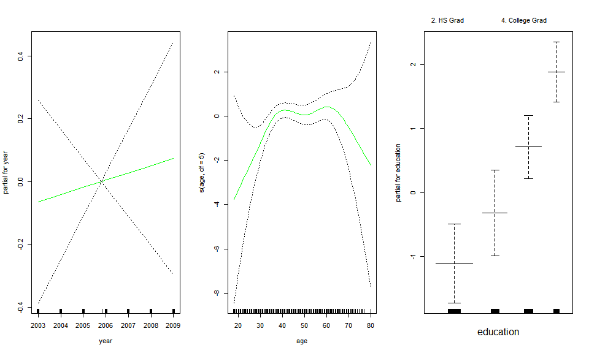

7\. Moving Beyond Linearity
================

  - Local regression: s에 따라서 가중치를 주어 부분 함수를 구성하는 것.
  - Nearest-Neighbor와 유사, glm? s를 정한다는데 모르겠다.
  - GAMs (Generalized Additive Models)
  - 각 예측변수별로 반응변수와의 관계를 찾아 그냥 더해서 만드는 모형
  - 단점: important interactions will miss

### pre-requires

``` r
## library(ISLR)
library(splines)    # ns()
library(gam)        # s(), plot.Gam()
data(Wage, package = "ISLR")
attach(Wage)
```

-----

### GAMs: Generalized Additive Models

``` r
gam1 = lm(wage ~ ns(year, 4) + ns(age, 5) + education)
```

  - 사실 처음에 그냥 더해서 만들어진다는 걸 너무 강조해서 단순으로 구한 계수까지 구해서 선형 결합하는 건 줄 알고 진짜
    식겁했다.
  - 다행히 모형만을 더하는 개념이었다. 그래서 이런 식으로도 만들 수 있다.
  - Natural Spline을 이용했는데, GAMs에선 Smoothing Spline을 사용함.

<!-- end list -->

``` r
par(mfrow = c(1,3))
plot.Gam(gam1, se = T, col = "red")
```



``` r
## 이렇게 하면 lm으로도 만들 수 있단 사실.

gam.m3 = gam(wage ~ s(year, 4) + s(age, 5) + education)
plot(gam.m3, se = T, col = "blue")
```



``` r
gam.m1 = gam(wage ~ s(age, 5) + education)
gam.m2 = gam(wage ~ year + s(age, 5) + education)
anova(gam.m1, gam.m2, gam.m3, test = 'F')
```

    ## Analysis of Deviance Table
    ## 
    ## Model 1: wage ~ s(age, 5) + education
    ## Model 2: wage ~ year + s(age, 5) + education
    ## Model 3: wage ~ s(year, 4) + s(age, 5) + education
    ##   Resid. Df Resid. Dev Df Deviance       F    Pr(>F)    
    ## 1      2990    3711731                                  
    ## 2      2989    3693842  1  17889.2 14.4771 0.0001447 ***
    ## 3      2986    3689770  3   4071.1  1.0982 0.3485661    
    ## ---
    ## Signif. codes:  0 '***' 0.001 '**' 0.01 '*' 0.05 '.' 0.1 ' ' 1

year가 선형으로 있는 게 낫지만, 과연 선형인가에 대한 증거가 없음.

``` r
## preds = predict(gam.m2, newdata = Wage)
summary(gam.m3)
```

    ## 
    ## Call: gam(formula = wage ~ s(year, 4) + s(age, 5) + education)
    ## Deviance Residuals:
    ##     Min      1Q  Median      3Q     Max 
    ## -119.43  -19.70   -3.33   14.17  213.48 
    ## 
    ## (Dispersion Parameter for gaussian family taken to be 1235.69)
    ## 
    ##     Null Deviance: 5222086 on 2999 degrees of freedom
    ## Residual Deviance: 3689770 on 2986 degrees of freedom
    ## AIC: 29887.75 
    ## 
    ## Number of Local Scoring Iterations: 2 
    ## 
    ## Anova for Parametric Effects
    ##              Df  Sum Sq Mean Sq F value    Pr(>F)    
    ## s(year, 4)    1   27162   27162  21.981 2.877e-06 ***
    ## s(age, 5)     1  195338  195338 158.081 < 2.2e-16 ***
    ## education     4 1069726  267432 216.423 < 2.2e-16 ***
    ## Residuals  2986 3689770    1236                      
    ## ---
    ## Signif. codes:  0 '***' 0.001 '**' 0.01 '*' 0.05 '.' 0.1 ' ' 1
    ## 
    ## Anova for Nonparametric Effects
    ##             Npar Df Npar F  Pr(F)    
    ## (Intercept)                          
    ## s(year, 4)        3  1.086 0.3537    
    ## s(age, 5)         4 32.380 <2e-16 ***
    ## education                            
    ## ---
    ## Signif. codes:  0 '***' 0.001 '**' 0.01 '*' 0.05 '.' 0.1 ' ' 1

#### local regression의 이용

> library(akima): 2차원 표면 plot

``` r
gam.lo.i = gam(wage ~ s(year, df = 4) + lo(age, span = 0.7) + education)
gam.lr = gam(I(wage > 250) ~ year + s(age, df = 5) + education, family = binomial)
table(education, I(wage > 250))
```

    ##                     
    ## education            FALSE TRUE
    ##   1. < HS Grad         268    0
    ##   2. HS Grad           966    5
    ##   3. Some College      643    7
    ##   4. College Grad      663   22
    ##   5. Advanced Degree   381   45

정말 고졸 전은 예측이 하나도 성공하지 않았구나.

``` r
par(mfrow = c(1,3))
plot(gam.lo.i)
```



``` r
plot(gam.lr, se = T, col = "green")
```



``` r
gam.lr.s = gam(I(wage > 250) ~ year + s(age, df = 5) + education, family = binomial, subset = (education != "1. < HS Grad"))
plot(gam.lr.s, se = T, col = "green")
```


R이 y축을 자동으로 해주니까 year의 se 모양이 아주 X가 다 됐는데.
