8\. Tree-Based Methods
================

Decision Tree

  - Bagging: Bootstrap 기법을 이용해 만든 (자기복제형) tree를 평균적으로 구성함.
  - Random Forest: bagging보단 나아간 방법, subset m 또한 randomly
  - Boosting: bagging하려고 나눈 데이터에서 첫번째로 tree를 구성하고, 나머진 validation set처럼
    사용.

### pre-requires

``` r
library(tree)           ## tree()
library(randomForest)   ## randomForest()
library(gbm)            ## gbm()
data(Carseats, package = "ISLR")
data(Boston, package = "MASS")
```

store unique data sets.

``` r
write.csv(Carseats, "Carseats.csv", row.names = T, quote = F)
write.csv(Boston, "Boston.csv", row.names = T, quote = F)
```

-----

### 1\. (simple) Tree

``` r
High = ifelse(Carseats$Sales <= 8, "No", "Yes")
Carseats = data.frame(Carseats, High)
```

``` r
tree = tree(High ~.-Sales, Carseats)
summary(tree)
```

    ## 
    ## Classification tree:
    ## tree(formula = High ~ . - Sales, data = Carseats)
    ## Variables actually used in tree construction:
    ## [1] "ShelveLoc"   "Price"       "Income"      "CompPrice"   "Population" 
    ## [6] "Advertising" "Age"         "US"         
    ## Number of terminal nodes:  27 
    ## Residual mean deviance:  0.4575 = 170.7 / 373 
    ## Misclassification error rate: 0.09 = 36 / 400

``` r
plot(tree)
text(tree, pretty = 0)
```

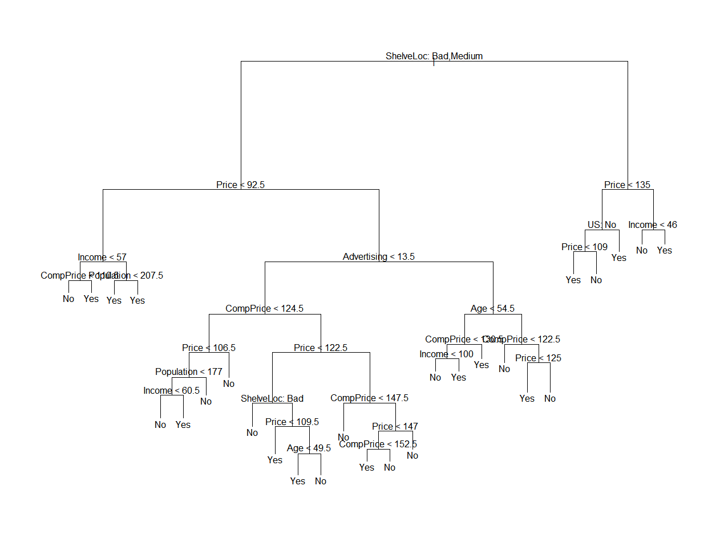
와. 함수는 알아보겠는데 설명으로 쓰인 식을 못 알아듣겠는데.

> text( ): node label display, pretty = 0: category name whole display

``` r
tree
```

    ## node), split, n, deviance, yval, (yprob)
    ##       * denotes terminal node
    ## 
    ##   1) root 400 541.500 No ( 0.59000 0.41000 )  
    ##     2) ShelveLoc: Bad,Medium 315 390.600 No ( 0.68889 0.31111 )  
    ##       4) Price < 92.5 46  56.530 Yes ( 0.30435 0.69565 )  
    ##         8) Income < 57 10  12.220 No ( 0.70000 0.30000 )  
    ##          16) CompPrice < 110.5 5   0.000 No ( 1.00000 0.00000 ) *
    ##          17) CompPrice > 110.5 5   6.730 Yes ( 0.40000 0.60000 ) *
    ##         9) Income > 57 36  35.470 Yes ( 0.19444 0.80556 )  
    ##          18) Population < 207.5 16  21.170 Yes ( 0.37500 0.62500 ) *
    ##          19) Population > 207.5 20   7.941 Yes ( 0.05000 0.95000 ) *
    ##       5) Price > 92.5 269 299.800 No ( 0.75465 0.24535 )  
    ##        10) Advertising < 13.5 224 213.200 No ( 0.81696 0.18304 )  
    ##          20) CompPrice < 124.5 96  44.890 No ( 0.93750 0.06250 )  
    ##            40) Price < 106.5 38  33.150 No ( 0.84211 0.15789 )  
    ##              80) Population < 177 12  16.300 No ( 0.58333 0.41667 )  
    ##               160) Income < 60.5 6   0.000 No ( 1.00000 0.00000 ) *
    ##               161) Income > 60.5 6   5.407 Yes ( 0.16667 0.83333 ) *
    ##              81) Population > 177 26   8.477 No ( 0.96154 0.03846 ) *
    ##            41) Price > 106.5 58   0.000 No ( 1.00000 0.00000 ) *
    ##          21) CompPrice > 124.5 128 150.200 No ( 0.72656 0.27344 )  
    ##            42) Price < 122.5 51  70.680 Yes ( 0.49020 0.50980 )  
    ##              84) ShelveLoc: Bad 11   6.702 No ( 0.90909 0.09091 ) *
    ##              85) ShelveLoc: Medium 40  52.930 Yes ( 0.37500 0.62500 )  
    ##               170) Price < 109.5 16   7.481 Yes ( 0.06250 0.93750 ) *
    ##               171) Price > 109.5 24  32.600 No ( 0.58333 0.41667 )  
    ##                 342) Age < 49.5 13  16.050 Yes ( 0.30769 0.69231 ) *
    ##                 343) Age > 49.5 11   6.702 No ( 0.90909 0.09091 ) *
    ##            43) Price > 122.5 77  55.540 No ( 0.88312 0.11688 )  
    ##              86) CompPrice < 147.5 58  17.400 No ( 0.96552 0.03448 ) *
    ##              87) CompPrice > 147.5 19  25.010 No ( 0.63158 0.36842 )  
    ##               174) Price < 147 12  16.300 Yes ( 0.41667 0.58333 )  
    ##                 348) CompPrice < 152.5 7   5.742 Yes ( 0.14286 0.85714 ) *
    ##                 349) CompPrice > 152.5 5   5.004 No ( 0.80000 0.20000 ) *
    ##               175) Price > 147 7   0.000 No ( 1.00000 0.00000 ) *
    ##        11) Advertising > 13.5 45  61.830 Yes ( 0.44444 0.55556 )  
    ##          22) Age < 54.5 25  25.020 Yes ( 0.20000 0.80000 )  
    ##            44) CompPrice < 130.5 14  18.250 Yes ( 0.35714 0.64286 )  
    ##              88) Income < 100 9  12.370 No ( 0.55556 0.44444 ) *
    ##              89) Income > 100 5   0.000 Yes ( 0.00000 1.00000 ) *
    ##            45) CompPrice > 130.5 11   0.000 Yes ( 0.00000 1.00000 ) *
    ##          23) Age > 54.5 20  22.490 No ( 0.75000 0.25000 )  
    ##            46) CompPrice < 122.5 10   0.000 No ( 1.00000 0.00000 ) *
    ##            47) CompPrice > 122.5 10  13.860 No ( 0.50000 0.50000 )  
    ##              94) Price < 125 5   0.000 Yes ( 0.00000 1.00000 ) *
    ##              95) Price > 125 5   0.000 No ( 1.00000 0.00000 ) *
    ##     3) ShelveLoc: Good 85  90.330 Yes ( 0.22353 0.77647 )  
    ##       6) Price < 135 68  49.260 Yes ( 0.11765 0.88235 )  
    ##        12) US: No 17  22.070 Yes ( 0.35294 0.64706 )  
    ##          24) Price < 109 8   0.000 Yes ( 0.00000 1.00000 ) *
    ##          25) Price > 109 9  11.460 No ( 0.66667 0.33333 ) *
    ##        13) US: Yes 51  16.880 Yes ( 0.03922 0.96078 ) *
    ##       7) Price > 135 17  22.070 No ( 0.64706 0.35294 )  
    ##        14) Income < 46 6   0.000 No ( 1.00000 0.00000 ) *
    ##        15) Income > 46 11  15.160 Yes ( 0.45455 0.54545 ) *

  - asterisk means it is a terminal node

##### train, test set split

``` r
## set.seed(2)
train = sample(1:nrow(Carseats), 200)
test = Carseats[-train,]
High.test = High[-train]
```

``` r
tree.carseats = tree(High ~.-Sales, Carseats, subset = train)
tree.pred = predict(tree.carseats, test, type = "class")
table(tree.pred, High.test)
```

    ##          High.test
    ## tree.pred No Yes
    ##       No  93  26
    ##       Yes 32  49

``` r
## sum(diag(table(tree.pred, High.test)))/200
```

``` r
## set.seed(3)
cv.carseats = cv.tree(tree.carseats, FUN = prune.misclass)
```

역시 함수가 좋아, cv가 바로 연결되어 있잖아.

``` r
## names(cv.carseats)
cv.carseats
```

    ## $size
    ## [1] 18 14 12  8  6  5  3  2  1
    ## 
    ## $dev
    ## [1] 48 46 45 41 52 54 55 66 90
    ## 
    ## $k
    ## [1] -Inf  0.0  0.5  1.0  3.0  4.0  6.0 13.0 28.0
    ## 
    ## $method
    ## [1] "misclass"
    ## 
    ## attr(,"class")
    ## [1] "prune"         "tree.sequence"

  - 값을 보면 dev가 제일 작을 때는 3, 4번째 항
  - 이때의 tree size(the number of terminal nodes)는 14와 9
  - interpret을 위해 tree는 작을수록 좋기 때문에 9를 선택

<!-- end list -->

``` r
par(mfrow = c(1, 2))
plot(cv.carseats$size, cv.carseats$dev, type = 'b')
plot(cv.carseats$k, cv.carseats$dev, type = 'b')
```

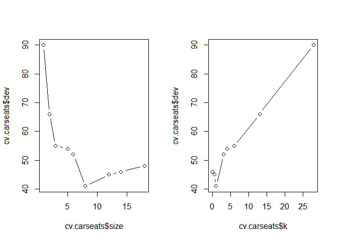

``` r
prune.carseats = prune.misclass(tree.carseats, best = 9)
plot(prune.carseats)
text(prune.carseats, pretty = 0)
```

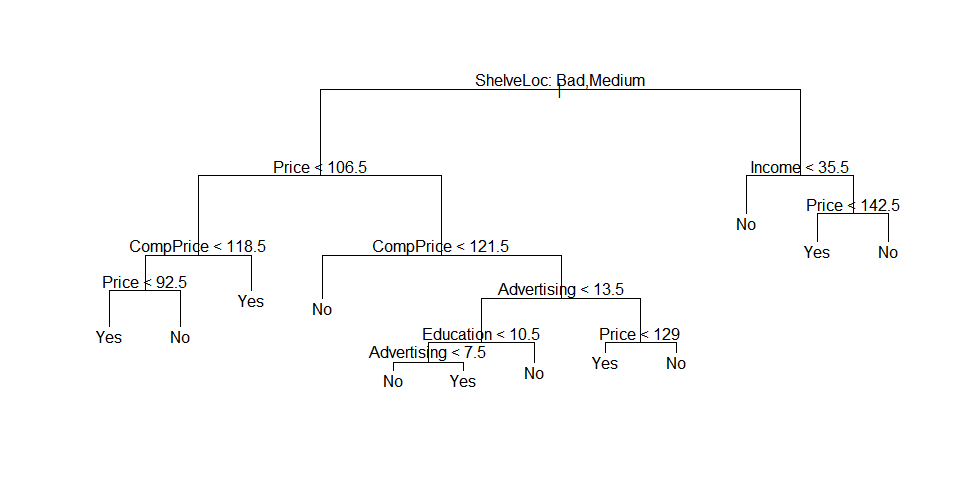
앞서 했던 그래프보단 정갈해졌음.

``` r
tree.pred = predict(prune.carseats, test, type = "class")
table(tree.pred, High.test)
```

    ##          High.test
    ## tree.pred  No Yes
    ##       No  103  30
    ##       Yes  22  45

``` r
## sum(diag(table(tree.pred, High.test)))/200
```

##### addition

``` r
prune.carseats = prune.misclass(tree.carseats, best = 15)
plot(prune.carseats)
text(prune.carseats, pretty = 0)
```

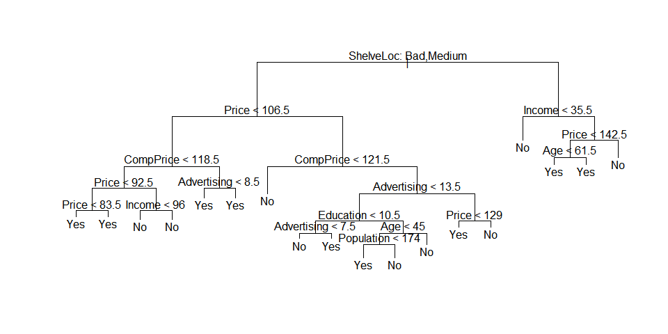

``` r
tree.pred = predict(prune.carseats, test, type = "class")
table(tree.pred, High.test)
```

    ##          High.test
    ## tree.pred No Yes
    ##       No  93  26
    ##       Yes 32  49

``` r
## sum(diag(table(tree.pred, High.test)))/200
```

와 같으면 안 되는데, 더 작은 예측력이 나와야 하는데 왜 같은 값.

-----

### 2\. Fitting Regression Trees

train vs. test(-train)

``` r
## set.seed(1)
train = sample(1:nrow(Boston), nrow(Boston)/2)
```

``` r
tree.boston = tree(medv ~., Boston, subset = train)
summary(tree.boston)
```

    ## 
    ## Regression tree:
    ## tree(formula = medv ~ ., data = Boston, subset = train)
    ## Variables actually used in tree construction:
    ## [1] "rm"    "lstat" "dis"  
    ## Number of terminal nodes:  7 
    ## Residual mean deviance:  16.54 = 4069 / 246 
    ## Distribution of residuals:
    ##     Min.  1st Qu.   Median     Mean  3rd Qu.     Max. 
    ## -23.5800  -2.2930   0.2068   0.0000   2.5070  14.4100

흠. 함수가 바뀐 것인가 train randomly가 너무 너무 잘 된 것인가.

``` r
plot(tree.boston)
text(tree.boston, pretty = 0)
```

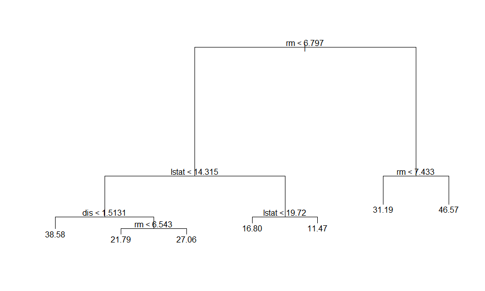
plot이 굉장히 다르게 나온 것 같군요. 뭐라는지 못 알아듣겠어요.

``` r
cv.boston = cv.tree(tree.boston)
plot(cv.boston$size, cv.boston$dev, type = 'b')
```

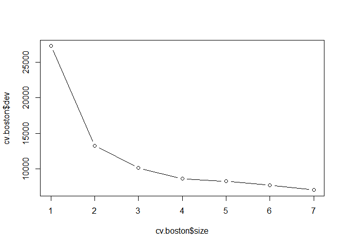
흠 제껀 size가 늘수록 dev가 감소하는 모양인데요.

##### 일단 조용히 따라해봅니다.

``` r
prune.boston = prune.tree(tree.boston, best = 5)
plot(prune.boston)
text(prune.boston, pretty = 0)
```

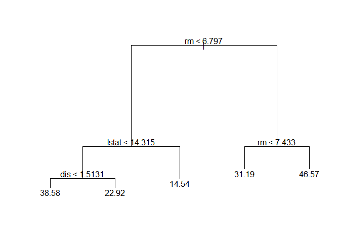
- 살짝 가지치기 되었습니다.

``` r
yhat = predict(tree.boston, newdata = Boston[-train,])
boston.test = Boston[-train, "medv"]
```

``` r
plot(yhat, boston.test)
abline(0, 1)
```

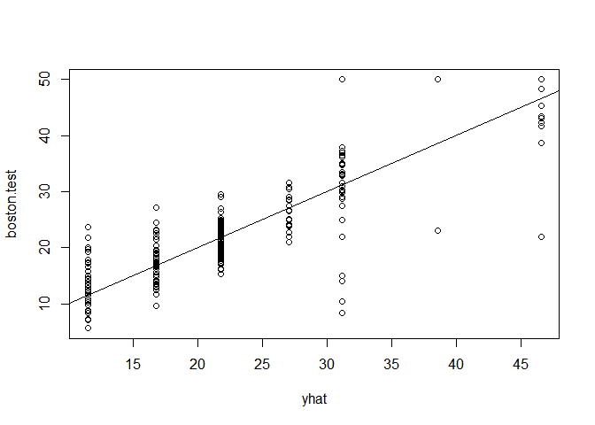
흠 솔직히 이 그림 좀 너무하단 생각이 드는데.. 변수 변환을 하거나 더미 변수를 쓰거나 둘 중 하나는 해야 할 것 같은데.

``` r
mean((yhat-boston.test)^2)
```

    ## [1] 23.21769

-----

### 3\. Bagging and Random Forests

``` r
## set.seed(1)
bag.boston = randomForest(medv ~., Boston, subset = train, mtry = 13, importance = T)
bag.boston
```

    ## 
    ## Call:
    ##  randomForest(formula = medv ~ ., data = Boston, mtry = 13, importance = T,      subset = train) 
    ##                Type of random forest: regression
    ##                      Number of trees: 500
    ## No. of variables tried at each split: 13
    ## 
    ##           Mean of squared residuals: 13.26021
    ##                     % Var explained: 87.18

> mtry = 13: 13개의 예측변수를 사용합니다.

``` r
yhat.bag = predict(bag.boston, newdata = Boston[-train,])
```

``` r
plot(yhat.bag, boston.test)
abline(0, 1)
```

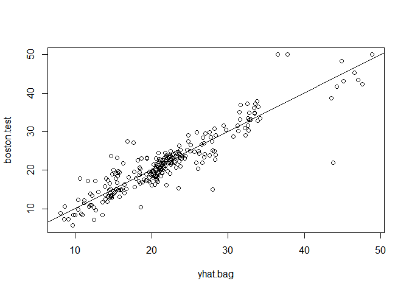

``` r
mean((yhat.bag - boston.test)^2)
```

    ## [1] 11.05898

##### ntree = 25

``` r
bag.boston = randomForest(medv ~., Boston, subset = train, mtry = 13, ntree = 25)
yhat.bag = predict(bag.boston, newdata = Boston[-train,])
mean((yhat.bag - boston.test)^2)
```

    ## [1] 11.44694

##### p/3

``` r
## set.seed(1)
rf.boston = randomForest(medv ~., Boston, subset = train, mtry = 6, importance = T)
yhat.rf = predict(rf.boston, newdata = Boston[-train,])
mean((yhat.rf - boston.test)^2)
```

    ## [1] 9.008564

seed에 영향인지 mtry를 작게 한 건데, 원래 randomforest보다 매우 약간 크게 나오네요

``` r
importance(rf.boston)
```

    ##           %IncMSE IncNodePurity
    ## crim    12.073374    1119.13847
    ## zn       3.805340      70.96849
    ## indus    9.313936    1129.13033
    ## chas     3.657739     115.27056
    ## nox     10.976579     999.68431
    ## rm      35.413962    9495.86200
    ## age      8.910181     459.02725
    ## dis     14.308825    1731.84997
    ## rad      4.442339     146.75150
    ## tax      8.777443     554.69069
    ## ptratio 11.881174    1534.68585
    ## black    7.019231     381.12926
    ## lstat   29.712824    8115.68303

대강 비슷하게 나오는 게 seed에 문제인 것인가<br /> randomforest의 내부 split 함수가 약간 바뀐 문제인 것
같기도.

``` r
varImpPlot(rf.boston)
```

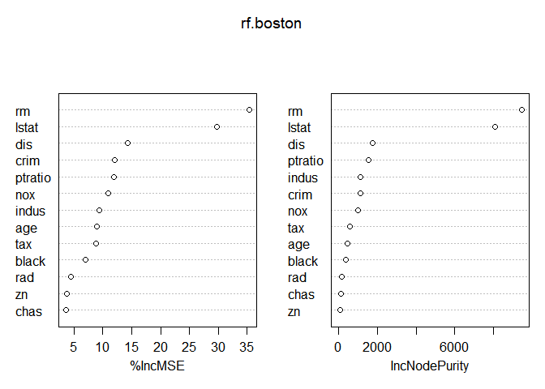
흠. 참 알아보기 쉽게 나오네요.

-----

### 4\. Boosting

``` r
## set.seed(1)
boost.boston = gbm(medv ~., Boston[train,], distribution = "gaussian", n.trees = 5000, interaction.depth = 4)
summary(boost.boston)
```

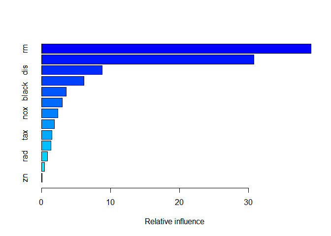

    ##             var     rel.inf
    ## rm           rm 39.08301695
    ## lstat     lstat 30.75466833
    ## dis         dis  8.80029070
    ## crim       crim  6.15926070
    ## black     black  3.58456517
    ## age         age  3.01060210
    ## nox         nox  2.40226495
    ## ptratio ptratio  1.89612177
    ## tax         tax  1.51462020
    ## indus     indus  1.39597424
    ## rad         rad  0.88305587
    ## chas       chas  0.43245474
    ## zn           zn  0.08310427

> 중요도 확인하게 sorting되어 나옴.

``` r
plot(boost.boston, i = "rm")
```

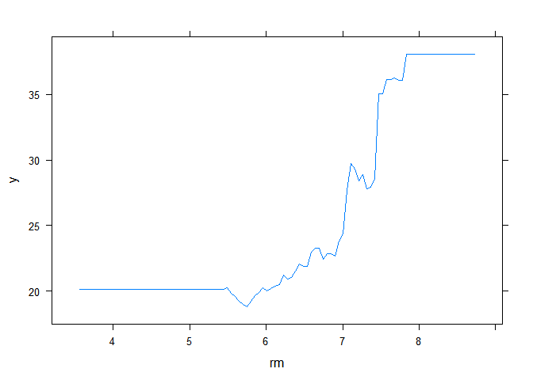

``` r
plot(boost.boston, i = "lstat")
```

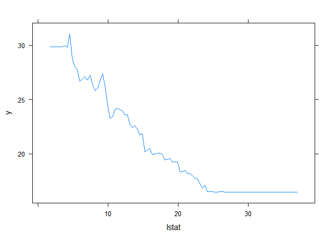
- i가 방법쪽을 논해서 그런지 한 번에 안 나온다.

``` r
yhat.boost = predict(boost.boston, newdata = Boston[-train,], n.trees = 5000)
mean((yhat.boost - boston.test)^2)
```

    ## [1] 12.14531

강의 때도 그랬지만, randomforest보다 더 나은 값으로 나오는데.

``` r
boost.boston = gbm(medv ~., Boston[train,], distribution = "gaussian", n.trees = 5000, interaction.depth = 4, shrinkage = 0.2, verbose = F)
```

> default: shrinkage = 0.001

``` r
yhat.boost = predict(boost.boston, newdata = Boston[-train,], n.trees = 5000)
mean((yhat.boost - boston.test)^2)
```

    ## [1] 12.69762

수축 모수(lambda?) 값을 늘렸는데 mse 추정도 늘어버렸다. 분명이 줄어든다고 배운 것 같은데.
