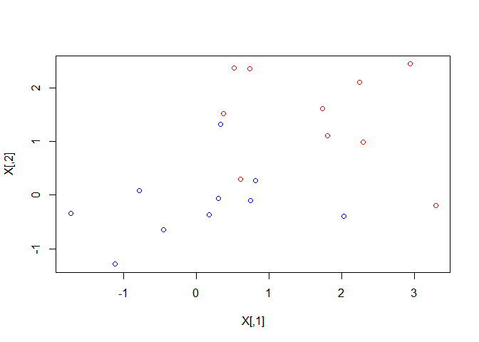
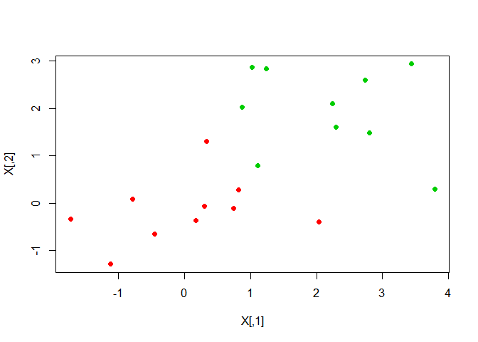
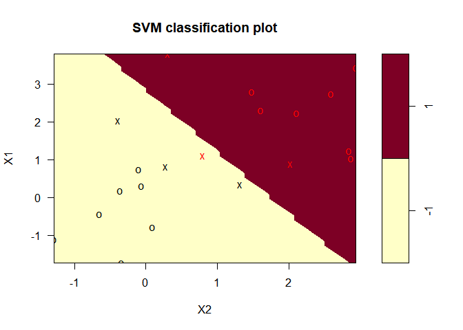
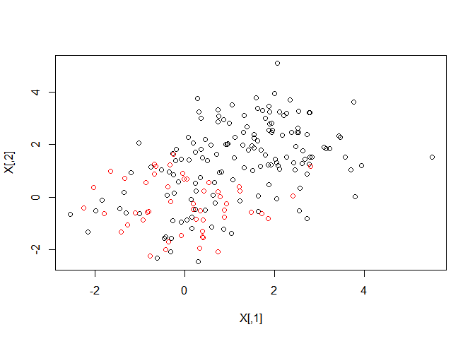
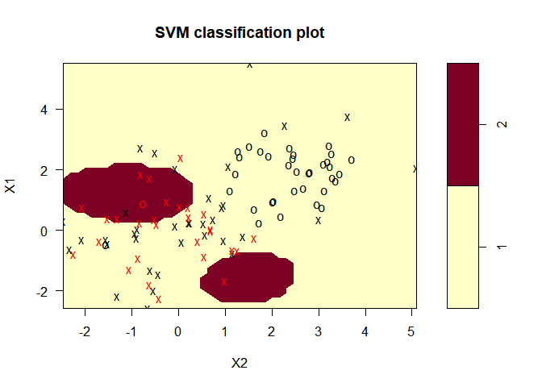
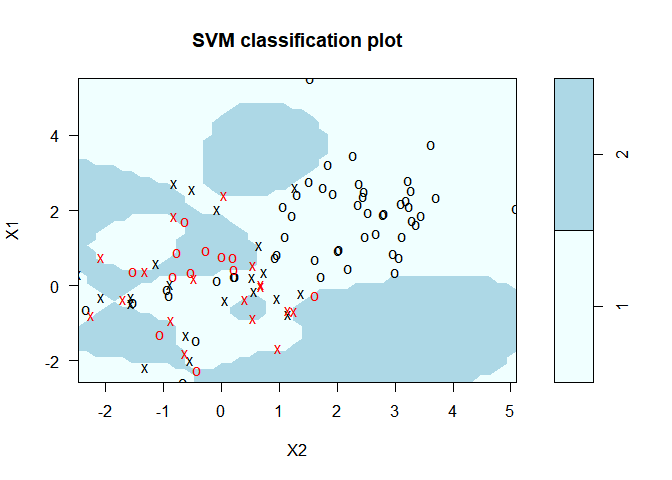
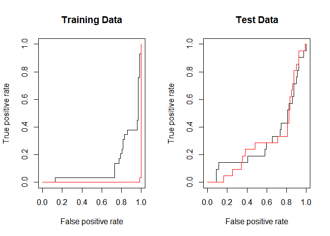
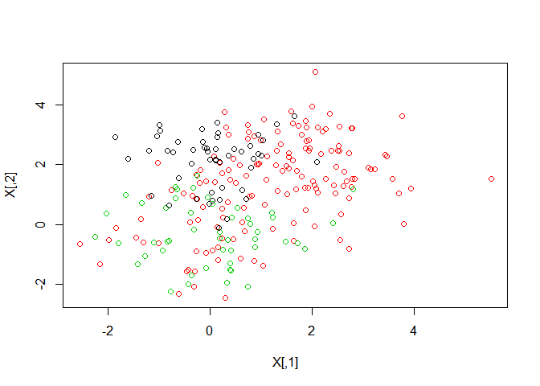
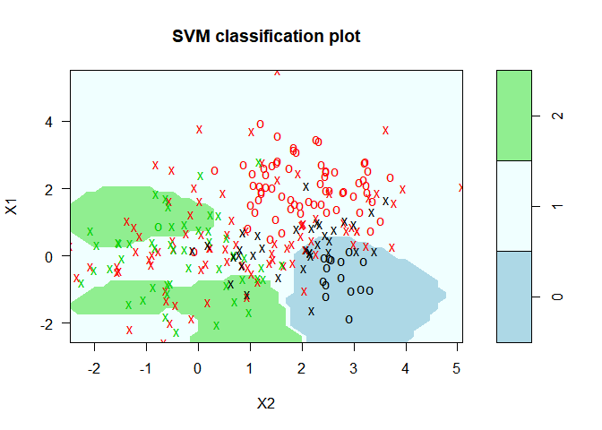

9\. Support Vector Machines
================

  - perfect separate: Maximal Margin Classifier, maximal margin
    hyperplane
  - Support Vectors (points), Support Vector Classifier
  - more flexible: Support Vector Machine
  - kernel: linear kernel(alike Person correlation), polynomial kernel,
    radial kernel etc.
  - bigger tuning parameter, many support vectors, wider margin, higher
    bias =\> low variance
  - More than two classes, can use SVM
  - almost (perfect) separate data set is uesful on SVM?
  - otherwise, Logistic Regression.
  - but SVM exists perfect zero point.

### pre-requires

``` r
library(e1071)      ## svm(), tune()
library(ROCR)       ## prediction(), performance()
data(Khan, package = "ISLR")
```

store unique data sets.

``` r
appending = function(dataframe, string) {
  if(is.null(dim(dataframe)[1]))
    tag = rep(string, length(dataframe))
  else tag = rep(string, dim(dataframe)[1])
  dataframe = cbind(dataframe, tag)
  return(dataframe)
}

ytrain = appending(Khan$ytrain, "train")
ytest = appending(Khan$ytest, "test")

khan2 = cbind(rbind(Khan$xtrain, Khan$xtest), rbind(ytrain, ytest))
write.csv(khan2, "Khan.csv", row.names = F, quote = F)
```

  - 처음에 너무 폭 넓게 만들고 조금씩 줄인 것. 딱히 함수 customizing은 할 필요 없었는데.

-----

### 1\. SVC: SV. Classifier (MMC, Maximal Margin Classifier)

``` r
## set.seed(1)
X = matrix(rnorm(20*2), ncol = 2)
y = c(rep(-1, 10), rep(1, 10))
X[y == 1,] = X[y == 1,] + 1
```

``` r
plot(X, col = (3 - y))
```



``` r
dat = data.frame(X, y = as.factor(y))
svmfit = svm(y ~., dat, kernel = "linear", cost = 10, scale = F)
```

> default is radial kernel

  - don’t do standardization

<!-- end list -->

``` r
plot(svmfit, dat)
```


> plot.svm() no longer exist, maybe

``` r
svmfit$index
```

    ## [1]  3  5  6 15 16 17

``` r
summary(svmfit)
```

    ## 
    ## Call:
    ## svm(formula = y ~ ., data = dat, kernel = "linear", cost = 10, scale = F)
    ## 
    ## 
    ## Parameters:
    ##    SVM-Type:  C-classification 
    ##  SVM-Kernel:  linear 
    ##        cost:  10 
    ## 
    ## Number of Support Vectors:  6
    ## 
    ##  ( 3 3 )
    ## 
    ## 
    ## Number of Classes:  2 
    ## 
    ## Levels: 
    ##  -1 1

##### changing tuning parameter

``` r
## set.seed(1)
tune.out = tune(svm, y ~., data = dat, kernel = "linear", ranges = list(cost = c(0.001, 0.01, 0.1, 1, 5, 10, 100)))
```

> tune(): 10-fold cross-validation

``` r
summary(tune.out)
```

    ## 
    ## Parameter tuning of 'svm':
    ## 
    ## - sampling method: 10-fold cross validation 
    ## 
    ## - best parameters:
    ##  cost
    ##     1
    ## 
    ## - best performance: 0.15 
    ## 
    ## - Detailed performance results:
    ##    cost error dispersion
    ## 1 1e-03  0.65  0.4743416
    ## 2 1e-02  0.65  0.4743416
    ## 3 1e-01  0.20  0.2581989
    ## 4 1e+00  0.15  0.2415229
    ## 5 5e+00  0.15  0.2415229
    ## 6 1e+01  0.20  0.2581989
    ## 7 1e+02  0.20  0.2581989

1 or 100 cost is best on my sampling data

``` r
bestmod = tune.out$best.model
summary(bestmod)
```

    ## 
    ## Call:
    ## best.tune(method = svm, train.x = y ~ ., data = dat, ranges = list(cost = c(0.001, 
    ##     0.01, 0.1, 1, 5, 10, 100)), kernel = "linear")
    ## 
    ## 
    ## Parameters:
    ##    SVM-Type:  C-classification 
    ##  SVM-Kernel:  linear 
    ##        cost:  1 
    ## 
    ## Number of Support Vectors:  8
    ## 
    ##  ( 4 4 )
    ## 
    ## 
    ## Number of Classes:  2 
    ## 
    ## Levels: 
    ##  -1 1

##### test the made support vector classifier model

``` r
xtest = matrix(rnorm(20*2), ncol = 2)
ytest = sample(c(-1, 1), 20, rep = T)
xtest[ytest == 1,] = xtest[ytest == 1,] + 1
testdat = data.frame(xtest, y = as.factor(ytest))
```

  - made confusion and conflict, because of colnames to upper alike
    sentense.

<!-- end list -->

``` r
ypred = predict(bestmod, testdat)
table(predict = ypred, truth = testdat$y)
```

    ##        truth
    ## predict -1  1
    ##      -1 14  4
    ##      1   1  1

##### test cost = 0.01

``` r
svmfit = svm(y ~., dat, kernel = "linear", cost = 0.01, scale = F)
ypred = predict(svmfit, testdat)
table(predict = ypred, truth = testdat$y)
```

    ##        truth
    ## predict -1  1
    ##      -1 14  3
    ##      1   1  2

##### almost linearly separable, hyperplane

``` r
X[y == 1,] = X[y == 1,] + .5
plot(X, col = (y + 5)/2, pch = 19)
```



``` r
dat = data.frame(X, y = as.factor(y))
svmfit = svm(y ~., dat, kernel = "linear", cost = 1e5)
summary(svmfit)
```

    ## 
    ## Call:
    ## svm(formula = y ~ ., data = dat, kernel = "linear", cost = 1e+05)
    ## 
    ## 
    ## Parameters:
    ##    SVM-Type:  C-classification 
    ##  SVM-Kernel:  linear 
    ##        cost:  1e+05 
    ## 
    ## Number of Support Vectors:  3
    ## 
    ##  ( 2 1 )
    ## 
    ## 
    ## Number of Classes:  2 
    ## 
    ## Levels: 
    ##  -1 1

  - set gamma = .5, but don’t changed
  - still use many support vectors, like 8
  - set and use very randomly seed?

<!-- end list -->

``` r
svmfit = svm(y ~., dat, kernel = "linear", cost = 1)
summary(svmfit)
```

    ## 
    ## Call:
    ## svm(formula = y ~ ., data = dat, kernel = "linear", cost = 1)
    ## 
    ## 
    ## Parameters:
    ##    SVM-Type:  C-classification 
    ##  SVM-Kernel:  linear 
    ##        cost:  1 
    ## 
    ## Number of Support Vectors:  6
    ## 
    ##  ( 3 3 )
    ## 
    ## 
    ## Number of Classes:  2 
    ## 
    ## Levels: 
    ##  -1 1

``` r
plot(svmfit, dat)
```



-----

### 2\. SVM: Support Vector Machine

##### almost non-linear

``` r
## set.seed(1)
X = matrix(rnorm(200*2), ncol = 2)
X[1:100,] = X[1:100,] + 2
y = c(rep(1, 150), rep(2, 50))
dat = data.frame(X, y = as.factor(y))
```

``` r
plot(X, col = y)
```



  - col = c(“blue”, “green”), pretty good

<!-- end list -->

``` r
train = sample(200, 100)
svmfit = svm(y ~., dat[train,], gamma = 1, cost = 1)
```

> default is radial kernel

> naturally, exist difference with use custom gamma and default gamma

``` r
plot(svmfit, dat[train,])
```



``` r
summary(svmfit)
```

    ## 
    ## Call:
    ## svm(formula = y ~ ., data = dat[train, ], gamma = 1, cost = 1)
    ## 
    ## 
    ## Parameters:
    ##    SVM-Type:  C-classification 
    ##  SVM-Kernel:  radial 
    ##        cost:  1 
    ## 
    ## Number of Support Vectors:  64
    ## 
    ##  ( 36 28 )
    ## 
    ## 
    ## Number of Classes:  2 
    ## 
    ## Levels: 
    ##  1 2

``` r
svmfit = svm(y ~., dat[train,], gamma = 1, cost = 1e5)
plot(svmfit, dat[train,], col = c("azure", "lightblue"))
```



##### change tuning parameter

``` r
## set.seed(1)
tune.out = tune(svm, y ~., data = dat[train,], ranges = list(cost = c(.1, 1, 10, 100, 10^3), gamma = c(.5, 1, 2, 3, 4)))
summary(tune.out)
```

    ## 
    ## Parameter tuning of 'svm':
    ## 
    ## - sampling method: 10-fold cross validation 
    ## 
    ## - best parameters:
    ##  cost gamma
    ##     1     1
    ## 
    ## - best performance: 0.27 
    ## 
    ## - Detailed performance results:
    ##     cost gamma error dispersion
    ## 1  1e-01   0.5  0.29  0.1370320
    ## 2  1e+00   0.5  0.36  0.1429841
    ## 3  1e+01   0.5  0.30  0.1490712
    ## 4  1e+02   0.5  0.28  0.1873796
    ## 5  1e+03   0.5  0.34  0.1505545
    ## 6  1e-01   1.0  0.29  0.1370320
    ## 7  1e+00   1.0  0.27  0.1766981
    ## 8  1e+01   1.0  0.30  0.1885618
    ## 9  1e+02   1.0  0.32  0.1475730
    ## 10 1e+03   1.0  0.38  0.1229273
    ## 11 1e-01   2.0  0.29  0.1370320
    ## 12 1e+00   2.0  0.31  0.1791957
    ## 13 1e+01   2.0  0.33  0.1766981
    ## 14 1e+02   2.0  0.37  0.1251666
    ## 15 1e+03   2.0  0.33  0.1567021
    ## 16 1e-01   3.0  0.29  0.1370320
    ## 17 1e+00   3.0  0.32  0.1873796
    ## 18 1e+01   3.0  0.32  0.1988858
    ## 19 1e+02   3.0  0.33  0.1059350
    ## 20 1e+03   3.0  0.36  0.1173788
    ## 21 1e-01   4.0  0.29  0.1370320
    ## 22 1e+00   4.0  0.32  0.1932184
    ## 23 1e+01   4.0  0.33  0.1946507
    ## 24 1e+02   4.0  0.34  0.1264911
    ## 25 1e+03   4.0  0.32  0.1032796

``` r
table(true = dat[-train, 'y'], pred = predict(tune.out$best.model, newdata = dat[-train,]))
```

    ##     pred
    ## true  1  2
    ##    1 68 11
    ##    2 15  6

  - “true”, “pred” are labeling on table

misclassifing ratio is 28%

-----

### ROC Curves

``` r
rocplot = function(pred, truth, ...) {
  predob = prediction(pred, truth)
  perf = performance(predob, "tpr", "fpr")
  plot(perf, ...)
}
```

##### train data

``` r
svmfit.opt = svm(y ~., dat[train,], gamma = 2, cost = 1, decision.values = T)
train.fitted.opt = attributes(predict(svmfit.opt, dat[train,], decision.values = T))$decision.values
```

  - best is gamma = 2, cost = 1 by book

<!-- end list -->

``` r
svmfit.flex = svm(y ~., dat[train,], gamma = 50, cost = 1, decision.values = T)
train.fitted.flex = attributes(predict(svmfit.flex, dat[train,], decision.values = T))$decision.values
```

##### test data

``` r
test.fitted.opt = attributes(predict(svmfit.opt, dat[-train,], decision.values = T))$decision.values
test.fitted.flex = attributes(predict(svmfit.flex, dat[-train,], decision.values = T))$decision.values
```

``` r
par(mfrow = c(1,2))
rocplot(train.fitted.opt, dat[train, 'y'], main = "Training Data")
rocplot(train.fitted.flex, dat[train, 'y'], add = T, col = "red")
rocplot(test.fitted.opt, dat[-train, 'y'], main = "Test Data")
rocplot(test.fitted.flex, dat[-train, 'y'], add = T, col = "red")
```



-----

### SVM with Multiple classes

``` r
## set.seed(1)
X = rbind(X, matrix(rnorm(50*2), ncol = 2))
y = c(y, rep(0, 50))
X[y == 0, 2] = X[y == 0, 2] + 2
dat = data.frame(X, y = as.factor(y))
```

``` r
plot(X, col = (y + 1))
```



``` r
svmfit = svm(y ~., dat, cost = 10, gamma = 1)
plot(svmfit, dat, col = c("lightblue", "azure", "lightgreen"))
```


- changed colors, first colors so messy

-----

### Application to Gene Expression Data

  - functions are very normal functioning

<!-- end list -->

``` r
names(Khan)
```

    ## [1] "xtrain" "xtest"  "ytrain" "ytest"

``` r
dim(Khan$xtrain); dim(Khan$xtest)
```

    ## [1]   63 2308

    ## [1]   20 2308

``` r
length(Khan$ytrain); length(Khan$ytest)
```

    ## [1] 63

    ## [1] 20

``` r
table(Khan$ytrain); table(Khan$ytest)
```

    ## 
    ##  1  2  3  4 
    ##  8 23 12 20

    ## 
    ## 1 2 3 4 
    ## 3 6 6 5

``` r
dat = data.frame(Khan$xtrain, y = as.factor(Khan$ytrain))
```

``` r
out = svm(y ~., dat, kernel = "linear", cost = 10)
summary(out)
```

    ## 
    ## Call:
    ## svm(formula = y ~ ., data = dat, kernel = "linear", cost = 10)
    ## 
    ## 
    ## Parameters:
    ##    SVM-Type:  C-classification 
    ##  SVM-Kernel:  linear 
    ##        cost:  10 
    ## 
    ## Number of Support Vectors:  58
    ## 
    ##  ( 20 20 11 7 )
    ## 
    ## 
    ## Number of Classes:  4 
    ## 
    ## Levels: 
    ##  1 2 3 4

``` r
table(out$fitted, dat$y)
```

    ##    
    ##      1  2  3  4
    ##   1  8  0  0  0
    ##   2  0 23  0  0
    ##   3  0  0 12  0
    ##   4  0  0  0 20

``` r
dat.te = data.frame(Khan$xtest, y = as.factor(Khan$ytest))
pred.te = predict(out, newdata = dat.te)
table(pred.te, dat.te$y)
```

    ##        
    ## pred.te 1 2 3 4
    ##       1 3 0 0 0
    ##       2 0 6 2 0
    ##       3 0 0 4 0
    ##       4 0 0 0 5
